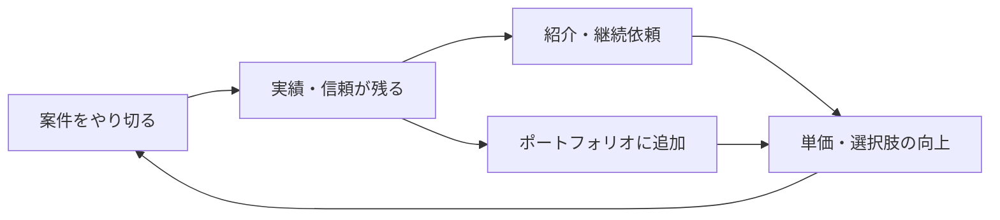

## このセクションで学ぶこと

- 正社員とフリーランスで長期キャリアの広がり方の違いを理解する
- 実績・信頼の積み上げが将来の選択肢と単価につながることを把握する
- 働き方は固定ではなく、行き来できる前提でキャリアを描く視点を持つ

## キャリアの「伸びる方向」が違う

長い目で見たとき、正社員とフリーランスではキャリアの広がる方向に違いが出やすくなります。

正社員のキャリアは、組織のなかで役割が広がっていく形が多くあります。技術を深める道のほかに、チームリーダーや管理職としての**マネジメント**、プロダクト全体を見る立場など、一人では担えない大きな仕事に関わるチャンスが得やすいのが特徴です。組織の看板や規模を背景に、長期のプロジェクトや大きな予算を動かす経験を積めることもあります。

フリーランスのキャリアは、**専門性**を軸に広げていく形が中心になります。特定の技術領域で「この人に頼みたい」と思われる存在になることが、単価や継続的な依頼に直結します。たとえば、ある分野の設計やトラブル対応で頼られる立場になれば、同じ稼働時間でも高い単価で発注されやすくなります。複数の現場を経験できるため知見の幅は広がりやすい一方、一つの組織を長期で率いるような経験や、社内の意思決定に深く関わる経験は積みにくい面があります。どちらの道にも得やすいものと得にくいものがある、と理解しておくとよいでしょう。

## 実績と信頼が次の仕事を呼ぶ

どちらの働き方でも共通して効いてくるのが、**実績と信頼の積み上げ**です。特にフリーランスでは、過去の仕事の評判がそのまま次の案件の獲得力になります。

きちんとやり切った仕事は、紹介や継続依頼という形で次につながり、**ポートフォリオ**として見せられる実績にもなります。たとえば「この規模のサービスで、この役割を担った」と具体的に語れる実績が増えるほど、初めて会う相手にも信頼を示しやすくなります。この循環が回るほど、単価交渉力や案件の選択肢が増え、結果としてキャリアの自由度が上がっていきます。逆に、目先の報酬だけを優先して雑な仕事を重ねると、評判を通じて将来の案件を細らせてしまうこともあります。前のセクションで触れた「自分で評価サイクルを回す」姿勢が、ここで効いてくるわけです。

## 注意点 — 働き方は一度きりの選択ではない

「正社員か、フリーランスか」を一生の決断のように捉える必要はありません。実際には、正社員で経験と人脈を積んでから独立する人も、フリーランスを経て再び組織に入る人も珍しくありません。市場の状況やライフステージによって最適な働き方は変わります。大切なのは、どちらの立場でも通用する実績・専門性・信頼を蓄えておくことで、これがあれば働き方を切り替えるときの選択肢が広がります。なお、ここで述べたキャリアの傾向はあくまで一般論であり、業界や個々の状況によって異なる点には留意してください。

## まとめ

- 正社員はマネジメントなど組織内の役割拡大、フリーランスは専門性を軸に広がりやすい。
- 実績と信頼の積み上げが、紹介・継続依頼・単価向上の循環を生む。
- 働き方は行き来できる前提で、どちらでも通用する強みを蓄えるとよい。
