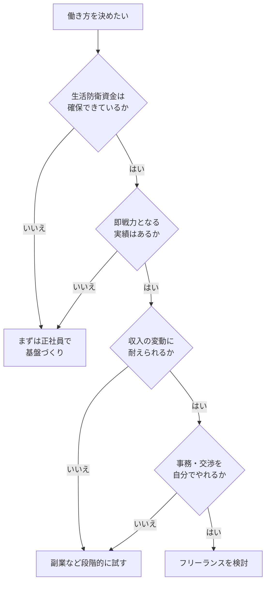

## このセクションで学ぶこと

- 働き方を選ぶための具体的な判断軸を一覧で把握する
- チェックリストを使って自分の状況を整理できる
- 判断フローに沿って、いまの自分に合う方向を見立てられる

## 「なんとなく」で決めないための判断軸

前のセクションで見た向き不向きの傾向を、もう少し実際に使える形に落とし込みます。働き方を選ぶときは、雰囲気や憧れだけで決めるのではなく、いくつかの軸に分けて自分の状況を確認すると、判断がぶれにくくなります。

この教材の第1章で挙げた「収入・税金と社会保険・安定性・キャリア・向き不向き」という5つの比較軸を思い出してください。それらを自分ごとの質問に置き換えたものが、次のチェックリストです。漠然と「フリーランスは自由そう」「正社員は安心そう」といったイメージで比べると、いざ選んだあとに「思っていたのと違った」となりがちです。軸を分けて一つずつ確認することで、自分が本当に重視しているものが見えてきます。

## 判断のためのチェックリスト

以下の項目に、いまの自分がどう答えるかを考えてみてください。「はい」が多い側が、現時点で合いやすい方向の目安になります。

**フリーランス寄りのチェック**

- 数か月分の生活防衛資金がある、または近く用意できる
- 即戦力として案件に入れる実績・スキルがある
- 収入が月ごとに変動しても精神的に耐えられる
- 単価や契約条件の交渉、確定申告などの事務を自分でやる(または学ぶ)気がある
- 働く時間や場所を自分でコントロールしたい気持ちが強い

**正社員寄りのチェック**

- 毎月決まった収入があることを強く重視する
- まだスキルを伸ばす段階で、教われる環境に身を置きたい
- 税金や社会保険の手続きは会社に任せたい
- チームで分担・相談しながら働くほうが力を出せる
- ライフステージ上、収入の安定が必要な事情がある

どちらにも「はい」が多い、あるいはどちらも少ない場合は、無理に二択で決めず、次のセクションで扱う「段階的に試す」方法を検討する余地があります。

## 判断フローで見立てる

チェックリストの結果を、おおまかな流れにすると次のようになります。あくまで考えを整理するための目安であり、結論を強制するものではありません。

## 注意点 — チェックの結果は固定ではない

このチェックリストは、いまの自分を写し取るためのものです。半年後、スキルや貯蓄、生活状況が変われば答えも変わります。一度やって終わりにせず、節目ごとに見直すとよいでしょう。

また、各項目の重みは人によって違います。たとえば「安定が必要な事情」が一つあるだけで、ほかの条件を上回って正社員を選ぶ理由になることもあります。逆に、収入の変動を強く受け入れられる人なら、貯蓄がやや少なくてもフリーランスに踏み出すという判断もあり得ます。項目数の単純な多数決ではなく、自分にとって譲れない軸はどれかを意識してください。

このチェックリストの結果は、あくまで「いまの自分に合いやすい方向」を示すだけで、将来をずっと縛るものではありません。気になった項目があれば、対応する章に戻って詳しく確認するとよいでしょう。たとえば資金面が不安なら第2章や第3章、実績やスキルに自信が持てないなら第4章が参考になります。判断を一度で完結させようとせず、足りない情報を補いながら考えを固めていく姿勢が役立ちます。

## まとめ

- 雰囲気でなく、収入・安定・スキル・生活状況などの軸で自分を確認する。
- チェックリストの「はい」が多い側が現時点で合いやすい方向の目安になる。
- 結果は時期や事情で変わるため、節目ごとに見直すとよい。
