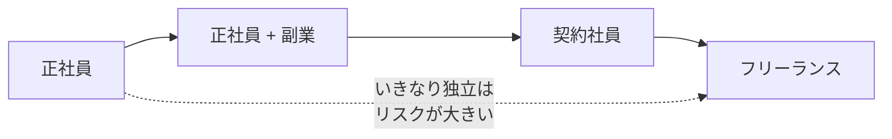

## このセクションで学ぶこと

- いきなり独立する以外の段階的な選択肢があることを理解する
- 副業・契約社員という中間的な働き方の特徴を説明できる
- リスクを抑えながら自分の適性を確かめる進め方を持てる

## 「正社員か、フリーランスか」だけではない

働き方を考えるとき、つい「会社を辞めて独立するかどうか」という二択で悩みがちです。しかし、その間にはいくつもの中間的な選択肢があります。いきなり独立して合わなかった場合、収入も保障も一度に失うことになりかねません。段階を踏めば、リスクを抑えながら自分の適性を確かめられます。

第1章の働き方マップで見たように、エンジニアの働き方は正社員とフリーランスの両端だけではなく、副業や契約社員といった形も含めて連続的に広がっています。

## 副業から小さく試す

最も始めやすいのが、正社員を続けながらの副業です。本業の収入という土台を残したまま、小規模な案件を受けてみることで、次のようなことを実地で確かめられます。

- 自分で案件を取り、納品し、報酬を受け取る一連の流れを体験できる。
- フリーランス的な働き方が、自分の性格や生活リズムに合うかを試せる。
- 本業以外の人脈や実績が増え、将来独立する場合の土台になる。

ただし、副業には注意点もあります。勤務先の就業規則で副業の可否や条件が定められていることが多く、まずはそれを確認するのが前提になります。また、一定の所得が出れば確定申告が必要になる場合があるなど、税務上の手続きが発生することもあります。本業に支障が出るほど抱え込まないことも大切です。これらは一般的な留意点であり、具体的な扱いは勤務先の規定や個別の状況によって異なります。

## 契約社員という中間形

もう一つの中間形が契約社員です。期間を定めた雇用契約で働くため、正社員ほどの長期的な保証はないものの、フリーランスと違って雇用契約に基づく保障(社会保険や雇用保険など)を受けやすい点が特徴です。特定のプロジェクト単位で複数の現場を経験したい人にとって、独立前のステップになることもあります。

図のように、左から右へ段階を踏むことで、収入と保障を急に失うことなく、自分に合う働き方を見極めていけます。もちろん必ずこの順に進む必要はなく、途中で正社員に戻る選択も自然なものです。

## 注意点 — 「試す」にも区切りを決めておく

段階的に試すこと自体は有効ですが、漫然と続けるとどっちつかずになりがちです。「半年やってみて手応えがあれば次に進む」といった区切りをあらかじめ決めておくと、判断がしやすくなります。前のセクションのチェックリストを、節目ごとの見直しに使うとよいでしょう。

## まとめ

- 働き方は二択ではなく、副業や契約社員という中間の選択肢がある。
- 副業は本業の収入を残したまま適性を試せるが、就業規則や税務の確認が前提。
- 段階的に進めるときは、見直しの区切りを決めておくと判断しやすい。
