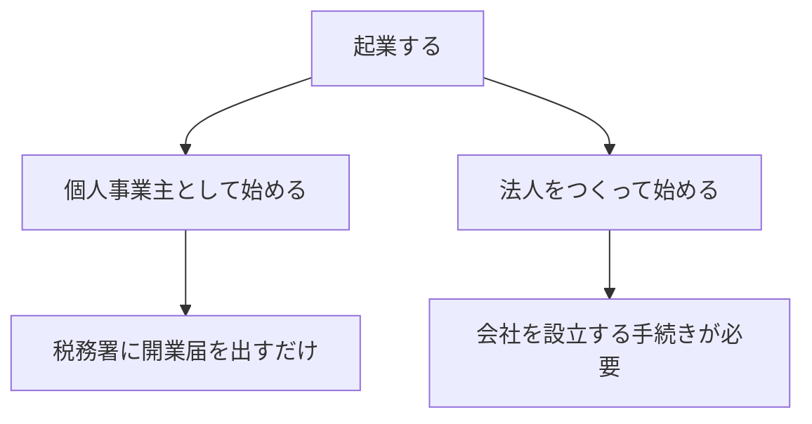

## このセクションで学ぶこと

- 「起業」と「開業」「会社設立」という言葉の関係を整理できる
- 起業の形態が大きく個人事業主と法人の2つに分かれることを理解する
- どの形態を選ぶかが手続きや税金・責任の範囲に影響することを把握する

## 「起業」はかたちを問わない

「起業」とは、自分で新しく事業を始めることを指す言葉です。ここで大切なのは、起業という言葉そのものは事業のかたちを限定していない、という点です。週末にひとりで始めるWeb制作の仕事も起業ですし、仲間と会社をつくって本格的にサービスを運営するのも起業です。

よく似た言葉に「開業」と「会社設立」があります。整理すると、開業は事業を始める行為全般を指し、会社設立はそのうち会社という組織をつくる手続きを指します。つまり起業という大きな入り口の先に、「会社をつくらずに始める」か「会社をつくって始める」かという分かれ道がある、とイメージすると理解しやすくなります。日常では「起業」「開業」「独立」などがほぼ同じ意味で使われることも多いのですが、本書ではこの分かれ道を意識するために、言葉を整理しておきます。

## 2つの代表的な形態 — 個人事業主と法人

事業を始めるときの代表的な形態は、大きく次の2つに分かれます。

**個人事業主**は、会社をつくらずに個人の名前で事業を営むかたちです。たとえばフリーランスのエンジニアが「○○(屋号)」として受託開発をする場合、多くは個人事業主にあたります。税務署に開業届を出せば始められる手軽さが特徴です。

**法人**は、会社などの組織をつくり、その組織が事業の主体になるかたちです。法人は法律上「人」と同じように契約を結んだり、財産を持ったりできる存在として扱われます。手続きや費用はかかりますが、後の章で見るように信用や税金の面でメリットが出る場面があります。

## 形態の選択が後々に効いてくる

どちらの形態を選ぶかは、単なる呼び方の違いではありません。開業の手続き、納める税金の種類、事業で負う責任の範囲、取引先からの信用といった、実務に直結する多くの点に影響します。

たとえば、小さく試しながら始めたい人にとっては個人事業主の手軽さが向いている一方、最初から大きな取引や資金調達を見据える人には法人が向いていることがあります。どちらが絶対的に正しいというものではなく、自分の状況や目指す規模によって適した選択は変わります。さらに、最初に個人事業主で始めて、事業が育ってから法人に切り替えるという段階的な進め方もあり、一度の選択が将来まで固定されるわけではありません。本章ではこの後、それぞれの形態を順番に見たうえで、最後に比較の観点を整理していきます。

なお、税金や手続きの細かい要件は制度改正で変わることがあり、個別の事情によっても扱いが異なります。実際に判断する際は、税理士などの専門家に相談することをおすすめします。

## まとめ

- 起業はかたちを問わず事業を始めること。その先に個人事業主か法人かの分かれ道がある
- 個人事業主は開業届で手軽に、法人は会社設立の手続きを経て始める
- 形態の選択は手続き・税金・責任・信用に影響するため、自分の状況に合わせて考える
