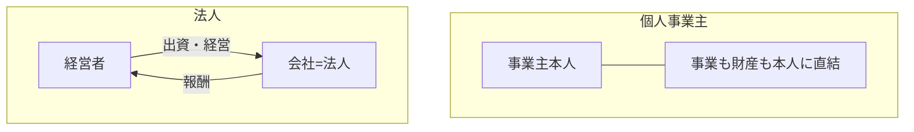

## このセクションで学ぶこと

- 法人とは何か、個人事業主との根本的な違いを理解する
- 法人設立に手続き・費用がかかること、法人税がかかることの輪郭をつかむ
- 有限責任や信用といった法人のメリットと、維持コストの注意点を把握する

## 法人は「もうひとりの人格」

法人とは、会社などの組織が法律上「人」と同じように扱われる存在です。この「法律上の人格」を法人格と呼びます。法人格を持つと、会社の名義で契約を結んだり、銀行口座を開いたり、財産を持ったりできるようになります。

ここが個人事業主との根本的な違いです。個人事業主では事業主本人がすべての主体ですが、法人では事業の主体は会社そのものになります。経営者は会社とは別の存在として、会社に出資したり、役員として会社から報酬を受け取ったりする関係になります。事業のお金と個人のお金がはっきり分かれるイメージです。

## 設立には手続きと費用がかかる

法人を始めるには、会社をつくる手続きが必要です。会社の名前や事業の目的、資本金などを決め、定款という会社のルールを定めたうえで、法務局で登記をすることで会社が成立します。この設立手続きには登録免許税などの費用がかかり、個人事業主の開業届のように無料・即日というわけにはいきません。

税金の面でも違いがあります。法人の利益には法人税がかかり、経営者個人が受け取る役員報酬には別途所得税がかかります。つまり、会社の利益と経営者個人の収入が別々に課税される点が、すべてが本人の所得になる個人事業主と大きく異なります。設立の具体的な流れや費用、税金の詳細は次章以降で扱いますが、ここでは「法人は手続きと費用を経て成立し、法人税の対象になる」という輪郭をつかんでおきましょう。

## メリットと注意点

法人の代表的なメリットは「有限責任」と「信用」です。有限責任とは、出資した範囲を限度に責任を負う考え方で、原則として会社の借金が経営者個人の財産にそのまま及ばない点が個人事業主の無限責任と対照的です。また、会社という形をとることで取引先や金融機関からの信用を得やすく、大きな取引や資金調達、人材採用の場面で有利に働くことがあります。

一方で注意点もあります。設立費用に加え、たとえ赤字でも毎年かかる税金(法人住民税の均等割など)や、会計・申告がより複雑になることによる維持コストがあります。手続きや事務の負担も個人事業主より重くなりがちです。

つまり法人は、信用や責任の面でのメリットと引き換えに、コストと手間が増える形態だといえます。どちらが自分に合うかは次のセクションで比較しながら考えます。なお、責任の範囲や税の扱いには例外や個別事情があるため、判断にあたっては税理士や司法書士などの専門家に相談することをおすすめします。

## まとめ

- 法人は法律上の人格を持ち、事業の主体が会社そのものになる
- 設立に手続き・費用がかかり、利益には法人税がかかる
- 有限責任や信用がメリットだが、維持コストと事務負担という注意点がある
