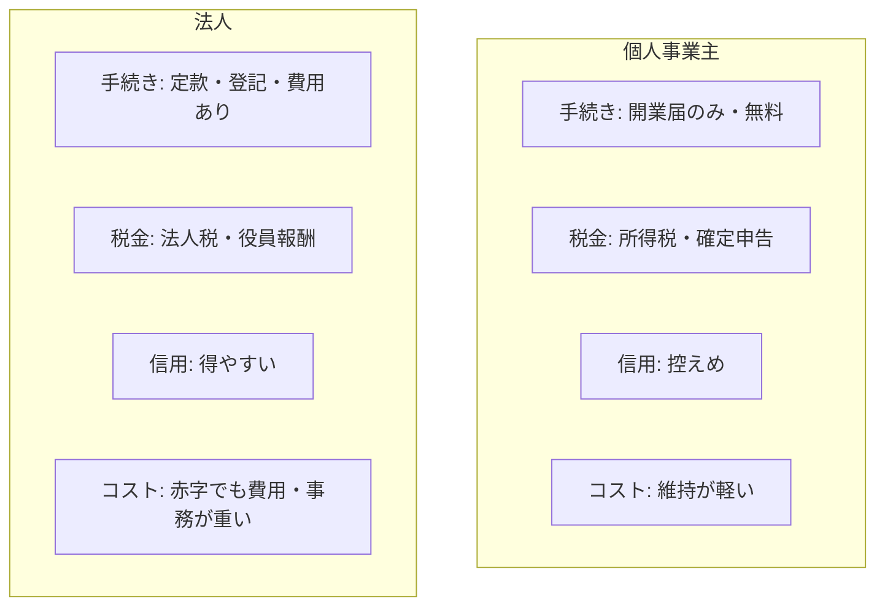

## このセクションで学ぶこと

- 手続き・税金・信用・コストの4つの観点で個人事業主と法人を比較できる
- 「迷ったらまず個人事業主」という考え方と、法人が向く典型例を理解する
- 状況の変化に応じて法人化する道があることを把握する

## 4つの観点で比べる

ここまで見てきた個人事業主と法人を、実務で効いてくる4つの観点で並べて比較してみましょう。

**手続き**の面では、個人事業主は開業届だけで無料・即日に近い一方、法人は定款作成や登記が必要で費用もかかります。**税金**の面では、個人事業主は所得に応じた所得税を確定申告で納め、法人は利益に法人税がかかり、経営者は役員報酬を通じて所得税を納める形になります。

**信用**の面では、会社というかたちを持つ法人のほうが取引先や金融機関から評価されやすく、大きな取引や採用で有利になりがちです。**コスト**の面では、個人事業主は維持が軽い一方、法人は赤字でもかかる税金や複雑な会計などの維持負担があります。

## まずは個人事業主、という考え方

これらを踏まえると、ひとつの目安として「迷ったらまず個人事業主で始める」という考え方があります。手続きが軽く、やめるのも簡単で、小さく試しながら事業の手応えを確かめられるからです。とくに、ひとりで始める受託やサービスの初期段階では、身軽さの恩恵が大きくなります。

一方で、法人が向く典型例もあります。たとえば、最初から大きな取引先と契約する見込みがある、出資を受けて事業を伸ばしたい、複数人で本格的にチームを組む、といったケースです。こうした場合は、信用や責任のかたちが整っている法人のほうが動きやすくなります。とくに、取引先が法人としか契約しない方針を持っていたり、人を雇って組織として動かしたい場合には、最初から法人を選ぶ意味が大きくなります。

## 後から法人化する道もある

重要なのは、最初の選択が一生続くわけではない、という点です。個人事業主として始めた事業が育ってきたら、後から法人に切り替える「法人化(法人成り)」という選択肢があります。売上や利益が一定の規模に達すると、税金や信用の面で法人のほうが有利になる場面が出てきて、それが法人化を検討するきっかけになります。

ですから、最初から完璧な選択をしようと気負う必要はありません。今の自分の事業規模・目指す方向・許容できる手間とコストを照らし合わせ、無理のないかたちから始めるのが現実的です。

ただし、どの時点で法人化すると有利かは売上・利益・家族構成など個別の事情に大きく左右され、制度改正の影響も受けます。具体的な損得の判断は、税理士などの専門家に相談することをおすすめします。

## まとめ

- 手続き・税金・信用・コストの4観点で見ると、両者の向き不向きが整理できる
- 迷ったらまず個人事業主、大きな取引や出資・チーム前提なら法人が向きやすい
- 後から法人化する道もあるので、無理のないかたちから始めればよい
