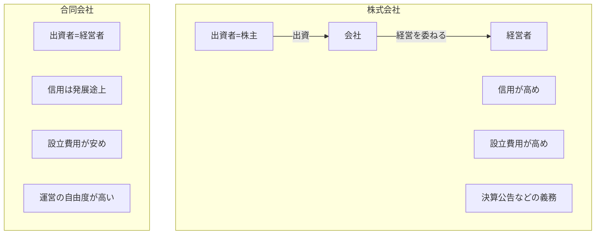

## このセクションで学ぶこと

- 法人にはいくつかの種類があり、起業では株式会社と合同会社が中心になることを理解する
- 株式会社と合同会社の意思決定・信用・コストの違いの概要をつかむ
- どちらを選ぶかは事業の規模や将来像によって変わることを知る

## 法人にはいくつかの種類がある

「会社をつくる」と一口に言っても、会社にはいくつかの種類があります。日本で設立できる会社は、株式会社・合同会社・合名会社・合資会社の 4 つです。このうち合名会社と合資会社は現在ほとんど使われておらず、これから起業する人が現実的に選ぶのは **株式会社** か **合同会社** のどちらかになります。

両者の最も大きな違いは「出資する人」と「経営する人」の関係です。株式会社は、お金を出す **出資者**(株主)と、実際に事業を動かす経営者が分かれていることを前提にした仕組みです。株主は会社の所有者として重要事項を決める権利を持ち、日々の経営は取締役などの経営者に委ねる、という役割分担が基本になります。これにより、外部から幅広く出資を集めながら経営をプロに任せる、といった拡張がしやすくなっています。

一方の合同会社は、出資した人がそのまま経営も担うことを基本としています。出資と経営が一体になっているぶん、意思決定がシンプルで、利益の分け方や運営ルールを出資者どうしの取り決めで柔軟に決めやすいのが特徴です。小さく始める段階では出資者と経営者が同じ人(自分一人)であることが多いため、合同会社の考え方は個人での起業と相性がよい面があります。

## 株式会社と合同会社の違いの概要

両者は次のような点で性格が異なります。あくまで一般的な傾向であり、細かい条件や費用は時期や状況によって変わるため、最新の情報は公的機関や専門家で確認してください。

ざっくり言えば、株式会社は「社会的な信用や知名度が得やすいが、設立や運営にコストと手間がかかる」形態です。取引先や金融機関からの見え方を重視する場合や、将来的に出資を受けて事業を大きくしたい場合に向きます。

合同会社は「設立費用が安く、運営の自由度が高いが、知名度はこれから」という形態です。一人または少人数で、まず身軽に法人を持ちたい場合に選ばれることが増えています。著名な外資系企業の日本法人が合同会社であることもあり、「合同会社だから信用が低い」とは一概には言えなくなってきています。また、合同会社は決算公告(決算の内容を外部に公表する手続き)が義務づけられていないなど、設立後の運営面でも手間が少なめです。一方で株式会社には決算公告の義務があり、こうした継続的な手間やコストの差も、形態選びでは見落とせないポイントになります。

なお、合同会社として始めた事業を後から株式会社へ変更する(組織変更する)ことも制度上は可能です。最初の選択がすべてを固定するわけではなく、事業の成長に合わせて見直せる余地がある、という点も知っておくと判断が楽になります。

## 注意点 — 「どちらが正解」はない

会社形態に唯一の正解はありません。取引先が法人格を気にするか、将来は出資を受けたいか、設立や維持のコストをどこまで抑えたいか——こうした要素のバランスで決まります。判断に迷う場合は、税理士や司法書士などの専門家に、自分の事業計画を前提に相談するのが確実です。次のセクションでは、どちらの形態を選ぶにしても設立前に決めておくべき項目を見ていきます。

## まとめ

- 起業で現実的に選ぶ会社形態は株式会社と合同会社の 2 つ。
- 株式会社は信用・拡張性に強く、合同会社はコストと自由度に強い。
- どちらが正解とは言えず、事業計画に応じて専門家に相談して選ぶのが安全。
