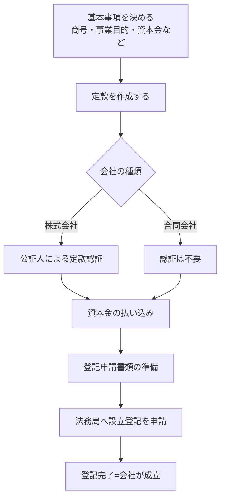

## このセクションで学ぶこと

- 定款作成から登記完了までの一般的な流れを順を追って俯瞰する
- 定款認証・資本金の払い込み・登記申請といった各ステップの位置づけを理解する
- 登記によって会社が法的に成立するという全体像をつかむ

## 設立は決まった順番で進む

前のセクションで決めた商号や事業目的などの中身を、実際の手続きに落とし込んでいきます。法人設立は、おおまかに「定款を作る → 認証を受ける → お金を払い込む → 登記する」という順番で進みます。ここでは株式会社を例に、全体の流れを俯瞰します。なお手順や必要書類は会社形態や時期によって異なり、制度も変わることがあるため、実際に進める際は法務局や専門家で最新の手順を確認してください。

## 定款作成から登記完了までの流れ

まず、決めておいた基本事項をもとに **定款** を作成します。定款は会社の基本ルールを定めた書類で、商号・事業目的・本店所在地・資本金といった、前のセクションで決めた内容がそのまま反映されます。ここがあいまいだと後の手続きが進まないため、定款は設立の出発点であり土台だと考えてください。株式会社の場合は、作成した定款を **公証人** にチェックしてもらう **定款認証** が必要になります。一方、合同会社では定款認証は不要で、この点が手続きの簡素さや費用の安さにつながっています。

次に、出資者が決めた金額の **資本金を払い込み** ます。払い込みは指定した口座に対して行い、払い込みがあったことを示す書類が登記の際に必要になります。その後、登記申請書や必要な添付書類をそろえ、**法務局** へ **設立登記** を申請します。書類が受理されて登記の手続きが完了すると、会社が正式に成立します。

## 注意点 — 登記で初めて会社が成立する

ここで押さえておきたいのは、会社は **設立登記が完了して初めて法的に成立する** という点です。「会社をつくると決めた日」や「定款を作った日」ではなく、登記された日が会社の誕生日にあたります。

また、登記申請には期限や必要書類のルールがあり、書類の不備があると差し戻されてやり直しになることもあります。たとえば資本金の払い込みの時期や、添付する書類の様式など、細かな決まりを満たしていないと受理されません。慣れない作業を一人で進めると時間がかかりがちなため、司法書士などの専門家に依頼したり、設立支援のサービスを使ったりするのも現実的な選択肢です。

さらに、登記が完了したら終わりではなく、その後に税務署や年金事務所などへの届け出が続きます。設立は一連の流れの入り口であり、全体像を先につかんでおくと、どこで専門家の手を借りるかの判断もしやすくなります。次のセクションでは、これらにかかる費用と専門家の活用について見ていきます。

## まとめ

- 設立は「定款作成 → (株式会社は)認証 → 資本金の払い込み → 登記」の順で進む。
- 合同会社では定款認証が不要で、手続きが比較的シンプル。
- 会社は設立登記が完了して初めて法的に成立する。
