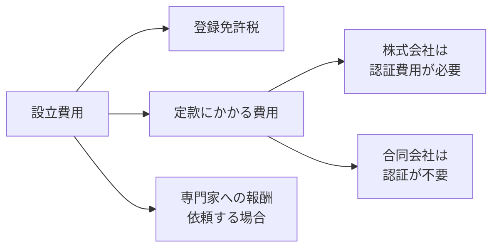

## このセクションで学ぶこと

- 法人設立にかかる費用にどんな種類があるかを把握する
- 株式会社と合同会社で費用感が異なることを理解する
- 専門家や設立支援サービスを使う判断の基準を持つ

## 設立にはお金がかかる

法人設立には、資本金とは別に手続きそのものの費用がかかります。代表的なものは、登記の際に国に納める **登録免許税**、株式会社で必要になる定款認証の費用、そして書類作成や相談を専門家に頼む場合の報酬です。これらは制度や依頼先によって金額が変わるため、ここでは「どんな費目があるか」という構造をつかむことを目的とします。具体的な金額は時期によって改定されることがあるので、公的機関や専門家で最新の情報を確認してください。

一般的な傾向として、合同会社は定款認証が不要で登録免許税も株式会社より低めに設定されているため、設立費用は株式会社より安く収まりやすいと言われています。費用を抑えたい段階では合同会社が選ばれやすい理由の一つです。逆に株式会社は、認証の費用や登録免許税が合同会社より高くなりやすいぶん、社会的な信用や将来の資金調達のしやすさといった面での見返りが期待できます。費用の高い・安いだけで決めるのではなく、その費用で何を得るのかをあわせて考えることが大切です。

## 自分でやるか、専門家に頼むか

設立手続きは、書類をそろえて自分で進めることもできますし、**司法書士** などの専門家に依頼することもできます。近年は、定款作成から登記書類の準備までを支援する **設立支援サービス** も増えており、費用を抑えつつ手間を減らせる選択肢になっています。

判断の目安はシンプルです。手続きに割ける時間があり、調べながら進めるのが苦でないなら自分で行う余地があります。一方、本業の準備に集中したい、書類の不備で差し戻されるリスクを避けたい、という場合は専門家やサービスを使う価値が高くなります。専門家への報酬はかかりますが、そのぶん時間と確実性を買っていると考えると納得しやすいはずです。

なお、専門家といっても役割は分かれています。登記そのものの代理は司法書士、税務の相談は税理士、許認可の手続きは行政書士、というように得意分野が異なります。自分が何に困っているかをはっきりさせると、誰に相談すべきかが見えてきます。

## 注意点 — 設立はゴールではなくスタート

費用の話で見落としがちなのが、設立後に継続して発生するコストです。法人は事業の有無にかかわらず毎年の税務申告などが必要で、ここに専門家の費用が継続的にかかることがあります。設立費用だけでなく、設立後の運営まで含めて見積もることが大切です。会計や税務の継続的な相談先については、後の章であらためて扱います。

## まとめ

- 設立費用には登録免許税・定款関連費用・専門家報酬などがある。
- 合同会社は認証不要などの理由で設立費用が抑えやすい傾向がある。
- 自分でやるか専門家に頼むかは、時間と確実性のバランスで判断する。
