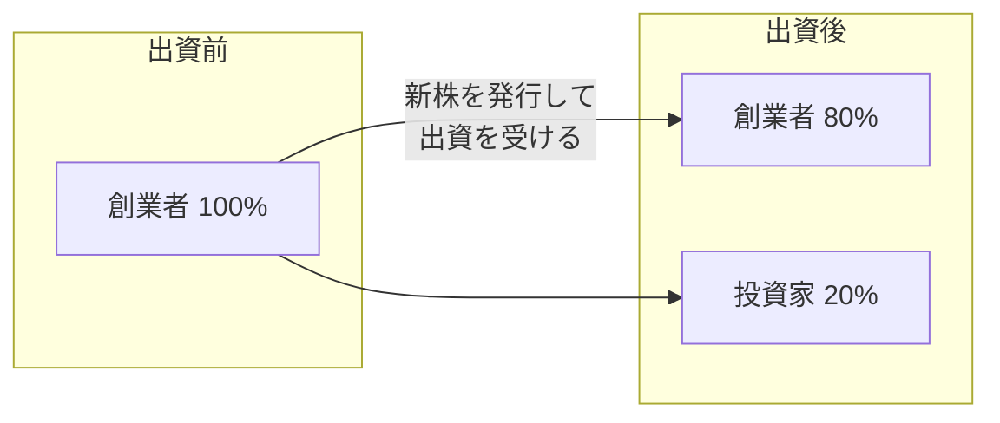

## このセクションで学ぶこと

- 資本金が何を表すお金なのかを理解する
- 株式と持ち株比率の関係を説明できる
- 出資を受けると持ち株比率が下がる(希薄化する)仕組みを理解する

## 資本政策とは「誰がどれだけ会社を持つか」の設計

**資本政策** とは、会社の株式を誰にどれだけ持ってもらうかを設計する、いわば会社の所有権の青写真です。難しく聞こえますが、根っこにあるのは「資本金」「株式」「持ち株比率」という三つの言葉です。これらを押さえれば、出資を受けるときに何が起きるのかが見通せるようになります。

**資本金** は、会社を設立・運営するために株主が出したお金です。会社の体力を示す目安の一つとされ、登記によって外部に公開されます。資本金が多いほど取引先や金融機関からの信用につながりやすい一方、税金や手続きの面で影響することもあるため、金額の設定は慎重に行います。

**株式** は、会社の所有権を細かく分けた単位です。株式を持つ人を **株主** と呼び、株主はその持っている割合に応じて会社の所有者となります。創業者一人で会社をつくった場合、最初は発行された株式をすべて自分が持っているのが一般的です。

## 持ち株比率は「会社への影響力」を表す

**持ち株比率** は、発行されている株式全体のうち、自分が何割を持っているかを示す割合です。これは単なる数字ではなく、会社の意思決定における影響力に直結します。

たとえば株主総会では、持ち株比率に応じて議決権が割り当てられます。重要な決定には過半数(2分の1超)や3分の2以上の賛成が必要とされる場面があり、持ち株比率が高いほど自分の意思を会社の方針に反映させやすくなります。逆に持ち株比率が下がると、自分の会社であっても思いどおりに決められなくなることがあります。

## 出資を受けると持ち株比率は下がる(希薄化)

ここで前のセクションの出資と話がつながります。新たに出資を受けるとき、会社は **新しい株式を発行** して投資家に渡します。すると株式の総数が増えるため、創業者がもともと持っていた株式の数は変わらなくても、全体に占める割合は下がります。これを **希薄化**(ダイリューション)と呼びます。

たとえば創業者が100%を持つ会社が出資を受け入れ、投資家に20%分の新株を渡すと、創業者の持ち株比率は80%に下がります。お金は増えますが、会社に対する影響力は少し手放したことになります。出資を重ねるほどこの希薄化は進むため、「いくら集めるか」と「どれだけ所有権を渡すか」のバランスを最初から考えておくことが大切です。

## 注意点

資本政策は **一度動かすと後戻りが難しい** 領域です。いったん株式を渡してしまうと、取り戻すのは容易ではありません。資本金の設定や株式の配分は税務・法務の影響も大きいため、出資や増資を検討する際は、税理士・弁護士やベンチャー支援の専門家に早めに相談することを強くおすすめします。ここでの説明は基本的な考え方の紹介にとどめており、個別の判断は専門家の助言を仰いでください。

## まとめ

- 資本政策は「誰がどれだけ会社を持つか」を設計するもので、資本金・株式・持ち株比率が基本。
- 持ち株比率は会社の意思決定への影響力に直結する。
- 出資を受けると新株発行により持ち株比率が下がる(希薄化)。後戻りが難しいため慎重に設計する。
