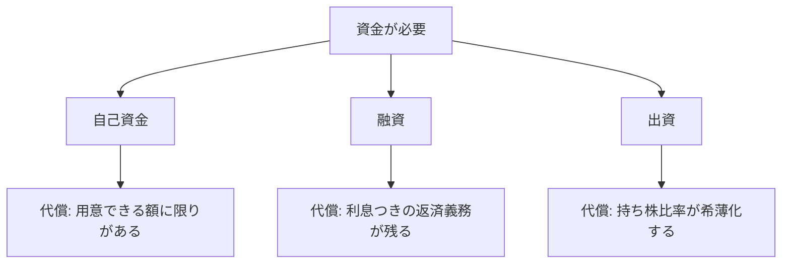

## このセクションで学ぶこと

- 事業の性質に応じて資金調達手段を選ぶ視点を持つ
- 各手段のメリットと代償(返済負担・所有権の分散)を整理して比較できる
- 調達を進める前に確認・相談すべきことを把握する

## 「いくら・いつ・どんな代償で」で選ぶ

ここまで見てきた **自己資金**・**融資**・**出資** は、どれが正解と決まっているものではありません。事業の性質に合わせて選び、組み合わせるのが現実的です。選ぶときの軸は、「いくら必要か」「いつ必要か」「どんな代償を受け入れられるか」の三つに整理できます。

たとえば、確実に利益を見込める堅実な事業を小さく始めるなら、自己資金と融資の組み合わせが向いています。借りた額を着実に返していけば、会社は自分のものとして手元に残ります。一方、市場を一気に取りに行くような急成長型の事業で、まとまった資金が早期に必要な場合は、返済不要の出資が選択肢になります。ただしその代わりに、持ち株比率の希薄化という代償を受け入れることになります。

## 三つの手段の代償を並べて見る

選択の本質は「メリットの裏にある代償」を理解することです。下の図は、それぞれの手段が何と引き換えに資金を得るのかを対比したものです。

自己資金は気軽ですが金額に限界があります。融資は所有権を守れる代わりに、事業がうまくいかなくても返済義務が残ります。出資は返済こそ不要ですが、会社の主導権を少しずつ手放すことになります。「返さなくていいから」と安易に出資へ偏ると、後から会社の意思決定を自由にできなくなることもあるため注意が必要です。

これらは二者択一ではありません。実際には、自己資金をベースに不足分を融資で補い、さらに大きく伸ばす段階で出資を受ける、というように段階的に組み合わせるのが一般的です。事業が今どの段階にあるか、これから数か月で何にお金を使うのかを起点に考えると、自分に合った組み合わせが見えてきます。一度にすべてを決めようとせず、必要になったタイミングで手段を足していく発想が現実的です。

## 進める前に確認・相談すること

実際に調達を進める前には、最低限これだけは確認しておきましょう。まず、本当に必要な金額を **開業資金と運転資金の両面** から見積もること。次に、返済や持ち株比率にどう影響するかを試算すること。そして、契約条件を自分だけで判断しないことです。

融資の審査基準や契約条件、出資にともなう株主間の取り決めは複雑で、一度合意すると後戻りが難しい部分が多くあります。融資なら金融機関や日本政策金融公庫の窓口、出資なら税理士・弁護士やベンチャー支援の専門家に早めに相談しながら進めるのが安全です。ここでの説明は一般的な考え方の紹介にとどめており、個別の判断は必ず専門家の助言を仰いでください。

## まとめ

- 資金調達は「いくら・いつ・どんな代償で」を軸に、事業の性質に合わせて選び組み合わせる。
- 自己資金は額に限界、融資は返済義務、出資は希薄化という代償がそれぞれにある。
- 必要額を見積もり、影響を試算し、契約条件は専門家に相談してから進める。
