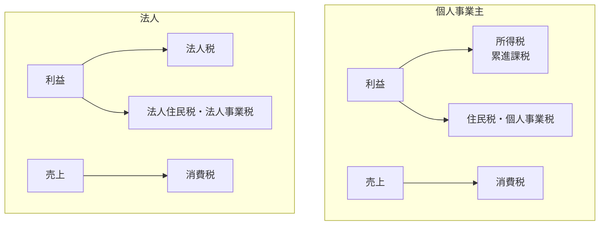

## このセクションで学ぶこと

- 個人事業主には所得税、法人には法人税という形で利益に税金がかかることを理解する
- 消費税は売上にかかる税で、規模によって納税義務が変わることを把握する
- 個人と法人で関わる主な税金の違いを対比して整理できる

## 利益にかかる税金 — 所得税と法人税

事業で得た利益には税金がかかります。誰が事業を行うかによって、税金の名前と仕組みが変わります。

個人事業主の場合は **所得税** がかかります。1年間の売上から経費を差し引いた「所得（利益）」に対して課税され、所得が多いほど税率が高くなる **累進課税** が特徴です。所得税のほかに、住民税や、一定以上の所得には個人事業税もかかります。

法人の場合は **法人税** がかかります。会社が得た利益に対して課税され、所得税のような細かい累進ではなく、比較的フラットな税率が基本です（規模により区分があります）。法人には法人税のほかに、法人住民税や法人事業税などもかかります。よく「利益が大きくなると法人のほうが税負担を抑えやすい」と言われるのは、この税率構造の違いが理由の一つです。ただし実際の有利・不利は所得水準や経費の使い方で変わるため、一律には言えません。

## 売上にかかる税金 — 消費税

所得税・法人税が「利益」にかかるのに対し、**消費税** は「売上（取引）」にかかる税金です。私たちが買い物のときに払う消費税は、お店が一時的に預かり、後でまとめて国に納めています。事業者から見ると、顧客から預かった消費税から、自分が仕入れなどで払った消費税を差し引いた差額を納める仕組みです。

消費税には、申告・納付の義務がある **課税事業者** と、義務が免除される免税事業者の区別があります。開業したばかりの小規模な事業者は当初は免税となる場合がありますが、売上の規模やインボイス制度への対応によって課税事業者になるかどうかが変わります。消費税は仕組みも判定も複雑で、近年も制度変更が続いている分野なので、自分が納税義務者に当たるかどうかは早めに確認が必要です。

## 個人と法人で関わる税金の対比

個人事業主と法人で、利益にかかる税金が変わる点を図で整理します。

## 注意点 — 税は変化が速い分野

税金は、税率や控除、納税義務の判定基準などが法改正でたびたび変わります。本セクションの説明はあくまで全体像をつかむためのもので、具体的な税額や、自分のケースでどの税金が・いくらかかるかを断定するものではありません。経費に何を入れられるか、消費税の課税事業者になるべきかといった判断は、有利・不利が状況によって逆転することもあります。実際の申告や節税の判断は、国税庁の公式情報を確認したうえで、税理士などの専門家に相談することを強くおすすめします。

## まとめ

- 利益には、個人事業主なら所得税（累進課税）、法人なら法人税がかかる。
- 消費税は売上にかかる税で、課税事業者か免税事業者かで納税義務が変わる。
- 税率や判定基準は頻繁に変わるため、具体的な判断は公式情報と専門家で確認する。
