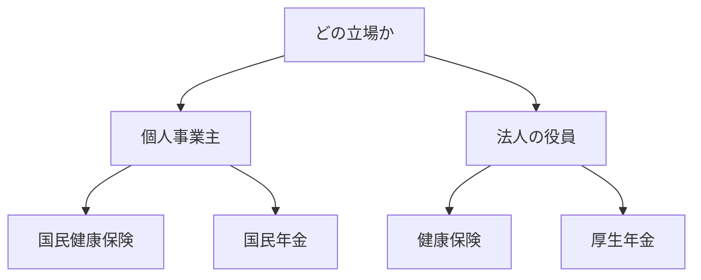

## このセクションで学ぶこと

- 社会保険（公的医療・年金など）の基本的な区分を理解する
- 個人事業主は国民健康保険・国民年金、法人役員は健康保険・厚生年金が基本という違いを把握する
- 会社員から起業した際に社会保険の扱いがどう変わるかをイメージできる

## 社会保険とは — 公的なセーフティネット

**社会保険** とは、病気やけが、老後、失業といったリスクに社会全体で備えるための公的な保険制度の総称です。代表的なものに、医療費の負担を軽くする「公的医療保険」と、老後などに給付を受けられる「公的年金」があります。会社員のときは給与から自動的に天引きされていたため意識しにくいですが、起業すると自分でどの制度に加入し、どう保険料を払うかを考える必要が出てきます。

会社員時代は、会社が手続きを代行し、保険料も会社と折半していました。起業すると、この前提が変わります。「会社員」「個人事業主」「法人の役員」のどれに当たるかによって、加入する制度と保険料の負担の仕方が変わるのです。

## 個人事業主と法人役員での違い

起業の形態によって、加入する社会保険は大きく変わります。

個人事業主の場合は、公的医療保険として **国民健康保険**、公的年金として **国民年金** に加入するのが基本です。これらは市区町村が窓口で、保険料は自分で全額を負担します。従業員を雇う場合は、人数などの条件によって別途の対応が必要になることがあります。

一方、法人をつくって自分が役員（社長）になる場合は、たとえ社長一人の会社であっても、原則として法人として健康保険・**厚生年金** といった社会保険に加入することになります。これらは国民年金に上乗せされる手厚い仕組みですが、保険料は会社と個人で負担し合う形になり、会社側の負担分も実質的には自分の事業から出ていきます。

## 注意点 — 切り替えの手続きと負担を見落とさない

会社員を辞めて起業すると、それまで加入していた会社の社会保険から抜けるため、自分で切り替えの手続きをする必要があります。退職後に一定期間だけ前職の健康保険を任意で継続できる制度などもあり、どれを選ぶかで保険料が変わることもあります。手続きには期限が決まっているものもあり、放っておくと無保険の期間ができてしまうおそれがあるため、退職のタイミングと合わせて早めに動くことが大切です。

また、法人化すると社会保険料の会社負担が発生するため、税金だけでなく社会保険料も含めた「手取り」で個人と法人を比べることが大切です。会社負担分も含めると、社会保険料の総額は決して小さくありません。一方で、厚生年金は将来受け取れる年金額が国民年金より手厚くなるなど、負担に見合うメリットもあります。目先の保険料の高さだけで判断せず、保障の内容まで含めて考えるとよいでしょう。加入義務の判定や手続きは制度が細かく、改正もあるため、年金事務所や市区町村の窓口、社会保険労務士などの専門家に確認すると安心です。

## まとめ

- 社会保険は医療・年金などのリスクに備える公的制度で、起業すると自分で加入を考える必要がある。
- 個人事業主は国民健康保険・国民年金、法人役員は健康保険・厚生年金が基本。
- 会社員からの切り替え手続きや法人の社会保険料負担を見落とさず、専門家にも確認する。
