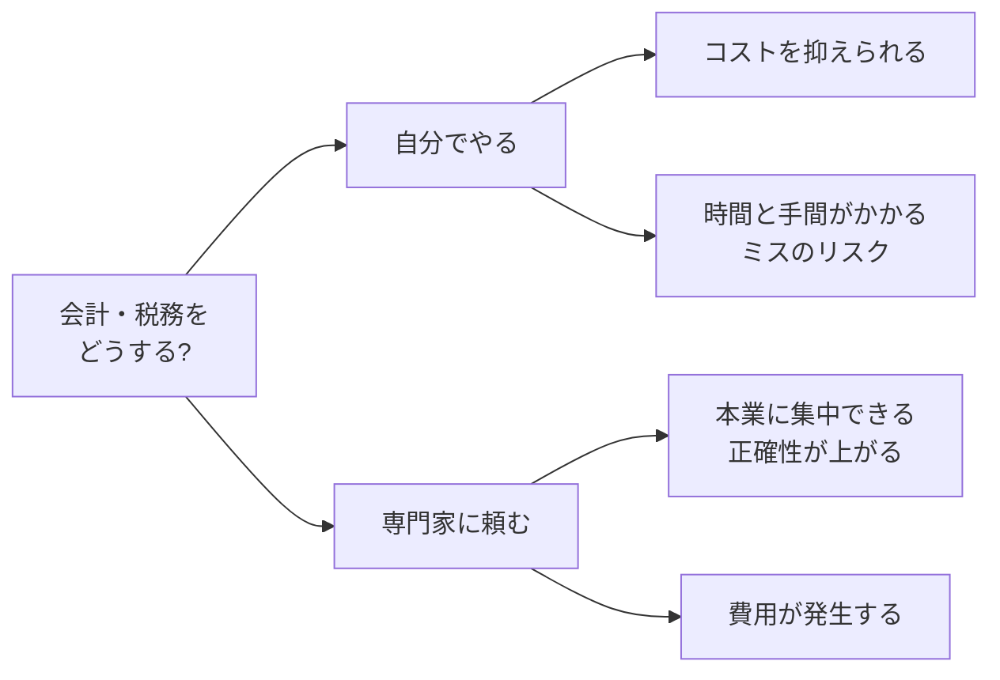

## このセクションで学ぶこと

- 税理士などの専門家が会計・税務でどんな役割を果たすかを理解する
- 自分でやる場合と専門家に頼む場合のメリット・コストを比較できる
- 起業後のどんな場面で専門家に相談すべきかの目安を持てる

## 税理士は何をしてくれるのか

ここまで見てきた会計・税金・社会保険は、いずれも「制度が細かく、改正も多い」という共通点がありました。これらをすべて自分で正確にこなすのは、本業を持つ起業家にとって大きな負担です。そこで頼りになるのが **税理士** をはじめとする専門家です。

税理士は税務の国家資格者で、確定申告や法人の決算申告を本人に代わって行う「税務申告の代理」、節税や制度に関する「税務相談」、帳簿が正しく付けられているかの「チェック」などを担います。日々の **記帳代行** まで含めて任せることもできますし、毎月や決算期に継続的にサポートを受ける **顧問契約** を結ぶこともあります。どこまでを依頼するかは、事業の規模や自分が割ける時間に応じて選べます。

なお、社会保険の手続きは社会保険労務士、登記は司法書士というように、分野ごとに専門家が分かれています。「税金のことは税理士」と覚えておくと、相談先を間違えずに済みます。

## 自分でやるか、頼むか

すべてを自分でやればコストはかかりませんが、その分の時間と手間、そしてミスのリスクを負います。専門家に頼めば費用は発生しますが、本業に集中でき、申告の正確性も高まります。両者の特徴を整理してみましょう。

開業したばかりで取引も少ないうちは、クラウド会計ソフトを使って自分で記帳・申告し、判断に迷う部分だけスポットで相談する、という始め方も現実的です。事業が成長して取引が増えたり、従業員を雇ったり、消費税の課税事業者になったりすると、自分だけで対応するのは次第に難しくなります。最初は自分でやり、必要になった段階で顧問契約に切り替える、というように、事業の成長に合わせて頼り方を変えていくのが無理のないやり方です。費用についても、税理士によって料金体系や対応範囲は大きく異なるため、複数の候補から見積もりを取り、依頼したい内容と予算が合うかを比べて選ぶとよいでしょう。

## 注意点 — 早めの相談がコストを下げることもある

「費用がもったいない」と相談を先延ばしにした結果、本来受けられた控除を逃したり、消費税の届出のタイミングを誤って不利になったりすることは珍しくありません。とくに法人設立の前後や、消費税の課税事業者になるかどうかの判断など、後から取り返しにくい場面では、早めに専門家へ相談する価値が高いといえます。本章で扱った会計・税務・社会保険の内容はいずれも全体像をつかむためのもので、個別の判断を断定するものではありません。最終的な手続きや節税の判断は、国税庁など公式の情報を確認したうえで、税理士などの専門家に相談して進めることを強くおすすめします。

## まとめ

- 税理士は税務申告の代理・税務相談・記帳代行などを担い、依頼範囲は事業規模に応じて選べる。
- 自分でやるとコストは抑えられるが手間とミスのリスクがあり、頼むと費用はかかるが本業に集中できる。
- 法人設立前後や消費税の判断など、後戻りしにくい場面では早めの相談が有利になりやすい。
