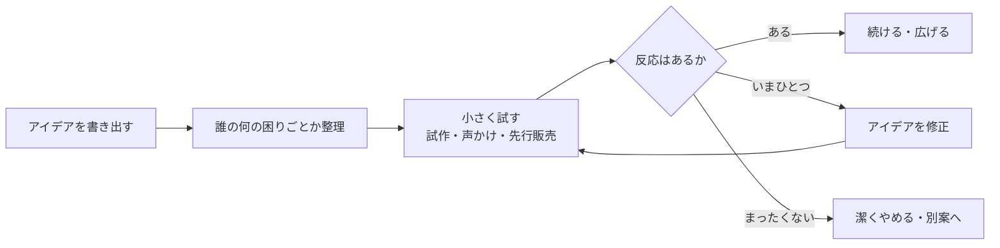

## このセクションで学ぶこと

- 起業の最初の一歩は「作り込む」ことより「確かめる」ことだと理解する
- アイデアを小さく検証するスモールスタートの流れを説明できる
- 検証の結果に応じて続ける・修正する・やめるを判断する視点を持つ

## 最初の一歩は「作る」より「確かめる」

起業を考えると、つい「立派なサービスを完成させてから世に出そう」と考えがちです。しかし最初の一歩として本当に大切なのは、作り込むことではなく、そのアイデアが誰かに求められているかを確かめることです。

どれだけ時間とお金をかけて作っても、欲しい人がいなければ事業は成り立ちません。逆に、未完成でも「お金を払ってでも使いたい」という人が見つかれば、それは大きな手応えになります。つまり起業の初期は、頭の中のアイデアを現実の反応で確かめる **アイデア検証** の段階だと考えると、力の入れどころを間違えずにすみます。アイデア検証とは、思いついた事業が本当に求められているかを、小さく試して確かめることを指します。

なぜこの順番が大切なのでしょうか。作り込みには時間とお金がかかりますが、その投資は「売れる」という前提が成り立って初めて報われます。ところがその前提こそ、最初の段階では誰にも確かめられていません。アイデアを思いついた本人は「これは絶対に役立つ」と確信しがちですが、その確信は思い込みである可能性も十分にあります。だからこそ、本格的に作り始める前に、現実の相手にぶつけて反応を見ることが何より重要になります。検証を先に置くことで、見込み違いに早く気づき、まだ被害が小さいうちに方向転換できるのです。

## スモールスタート — 小さく試して育てる

アイデアを確かめるための現実的な進め方が**スモールスタート**です。最初から完璧を目指さず、小さく・安く始めて、顧客の反応を見ながら少しずつ育てていきます。

たとえばWeb制作で独立したい人なら、いきなり立派な事務所を借りるのではなく、まず知人や前職のつながりに「こういう仕事を受けられます」と声をかけ、一件でも実際に受注してみる、といった進め方です。先に小さな注文を取れれば、需要があることを身をもって確かめられます。飲食やもの販売を考えている人であれば、店舗を構える前に、間借りやイベント出店、少量の試作品の先行販売で反応を見る、といった形が考えられます。

ここでのポイントは、「やってみたい」という気持ちだけで進めるのではなく、実際にお金や手間をかけてくれる相手がいるかどうかを確かめる点にあります。無料なら「いいね」と言ってくれる人は多くても、対価を払う段になると相手の本音が見えてきます。小さくても実際の取引が一件成立すれば、それはアンケートの好意的な回答よりずっと確かな証拠になります。スモールスタートは、こうした生きた手応えを低いコストで集めるための工夫だと言えます。

## 続ける・直す・やめるを冷静に見極める

スモールスタートの目的は、早い段階で事実をつかむことにあります。反応がよければ続けて広げ、いまひとつならアイデアを修正してもう一度試し、まったく反応がなければ潔く別の案に切り替える、という判断を冷静に行います。

ここで注意したいのは、最初の検証は「失敗」ではなく「情報収集」だという点です。小さく試して合わないと分かることは、大きく投資してから気づくよりずっと安全で、貴重な学びになります。次のセクションでは、この見極めがうまくいかないときに起こりがちな失敗のパターンを見ていきます。

## まとめ

- 起業の最初の一歩は作り込みより、求められているかの検証にある
- スモールスタートで小さく試し、顧客の反応を見ながら育てる
- 反応をもとに続ける・直す・やめるを冷静に見極め、検証を学びと捉える
