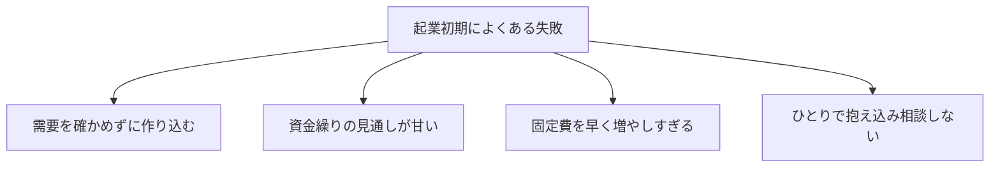

## このセクションで学ぶこと

- 起業初期によくある失敗のパターンを具体的に説明できる
- 失敗の多くが資金繰りと需要の見誤りに集約されることを理解する
- 失敗を避けるための予防的な考え方を身につける

## 失敗には繰り返されるパターンがある

起業の失敗は人それぞれに見えますが、初期に多いものはいくつかの典型的なパターンに整理できます。あらかじめ知っておくだけで、同じ落とし穴を避けやすくなります。

## 需要の見誤りと作り込みすぎ

最も多いのが、欲しい人がいるかを確かめないまま、製品やサービスを作り込んでしまう失敗です。前のセクションで触れたとおり、検証を飛ばして完成を目指すと、いざ世に出したときに「誰も求めていなかった」と気づくことになります。自分が欲しいものと、お金を払う人がいるものは別だ、という前提を忘れないことが予防になります。

似た失敗に、最初から大きく設備や在庫に投資してしまうケースがあります。需要が読めない段階で固定費を抱えると、思ったほど売れなかったときに身動きが取れなくなります。たとえば広い店舗を借りたり大量に仕入れたりすると、毎月の家賃や在庫の保管費が重くのしかかり、売上が想定を下回った瞬間に赤字が膨らみます。固定費はいったん増やすと簡単には下げられないため、需要が確かめられるまでは身軽さを保つことが大切です。

## お金が回らなくなる — 資金繰りの失敗

事業の継続を直接左右するのが**資金繰り**です。注意したいのは、利益が出ていることと手元の現金があることは別だという点です。売上が立っていても、入金より先に**運転資金**の支払いが来れば現金は尽きます。帳簿上は黒字なのに現金が足りず行き詰まる状態は**黒字倒産**と呼ばれ、起業初期に起こりがちです。

たとえば納品から入金まで数か月かかる取引で、その間に家賃や仕入れの支払いが続けば、売上があっても手元の現金は減っていきます。入金は先、支払いは先に来る——この時間のずれが資金繰りを苦しくする典型的な原因です。とくに取引先が大きい企業の場合、支払いサイトが長く設定されることも珍しくありません。

対策としては、いつお金が入っていつ出ていくかを月単位で書き出し、手元の現金が一番細る時期を事前につかんでおくことが有効です。売上の予測だけを見ていると黒字に見えても、現金が底をつくタイミングを見落とします。必要なら、その谷を越えるための運転資金をあらかじめ借入などで用意しておく判断も出てきます。売上の大きさと、現金が回っているかどうかは、別々に見る習慣をつけておきましょう。

## 抱え込みと、専門家への相談の遅れ

もうひとつ見落とされがちなのが、すべてをひとりで抱え込み、相談が遅れる失敗です。とくに税金や契約、社会保険といった分野は制度が複雑で、自己流の判断が後で大きな手戻りや負担につながることがあります。

これらは個別の事情や制度改正によって扱いが変わるため、一般論で断定はできません。早めに税理士などの専門家や、商工会議所・公的な相談窓口を頼ることが、結果的に失敗を減らす近道になります。

## まとめ

- 起業初期の失敗は、需要の見誤り・作り込みすぎ・資金繰り・抱え込みに集約されやすい
- 利益と現金は別物で、現金の流れを把握しないと黒字でも行き詰まることがある
- 税金や契約などは早めに専門家や相談窓口を頼ることが予防になる
