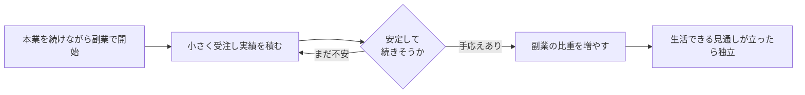

## このセクションで学ぶこと

- 副業から始めてリスクを抑える進め方を理解する
- 収入や顧客の見通しに応じて段階的に独立する考え方を説明できる
- 無理なく始めるために事前に確認・準備しておくことを把握する

## いきなり辞めない — 副業という入り口

起業というと「会社を辞めて退路を断つ」というイメージがありますが、必ずしもそうする必要はありません。本業の収入を保ったまま空き時間で始める**副業**は、リスクを抑えて事業を試せる現実的な入り口です。

副業のよいところは、収入の柱を残したまま前のセクションで見た検証ができる点です。うまくいかなくても生活が直ちに脅かされず、合わないと分かれば軌道修正もしやすくなります。小さく始めて確かめるという考え方と、副業はとても相性がよいのです。

前のセクションで見た失敗の多くは、退路を断ってから需要や資金繰りの問題に直面する点に共通項があります。副業はこの構図を和らげます。本業の給与という安定した収入があるあいだに事業を試せるので、資金繰りに追い詰められて焦った判断をするリスクが下がります。心理的にも、「失敗しても生活は続けられる」という余裕があると、目の前の反応を冷静に受け止めやすくなります。検証の質は、追い詰められていないときほど上がるものです。

## 段階的に独立する

副業で手応えが出てきたら、収入や顧客の見通しに応じて少しずつ独立へ移っていく**段階的な独立**が無理のない進め方です。

たとえば、平日は会社で働きながら週末に受託の仕事を少しずつ受け、安定して依頼が来るようになり、その収入で生活できる見通しが立った段階で独立する、という進め方です。一度に飛び移るのではなく、橋を架けながら少しずつ渡るイメージを持つと、不安をコントロールしやすくなります。

独立に踏み切る目安は人によって異なりますが、たとえば「副業の収入が数か月続けて生活費をまかなえている」「特定の取引先に依存せず複数の顧客から依頼が来ている」といった状態は、ひとつの判断材料になります。逆に、収入がまだ不安定だったり、たまたまの一件で勢いづいているだけの段階で本業を辞めると、前のセクションで見た資金繰りの失敗に近づいてしまいます。手応えが「続きそうか」を冷静に見極めることが、段階的な独立の肝になります。

## 始める前に確認・準備しておくこと

無理なく始めるためには、いくつか事前の確認と準備があると安心です。まず、収入が一時的に途絶えても暮らしを維持できる**生活防衛資金**として、生活費の数か月分を手元に確保しておくと、判断に余裕が生まれます。

また、勤務先で副業が認められているか、就業規則を必ず確認しておきましょう。会社によっては制限や届け出が必要な場合があります。あわせて、副業で一定以上の所得が出ると確定申告が必要になるなど、税務上の手続きが発生することもあります。

こうした制度の扱いは個別の事情や勤務先のルール、制度改正によって変わるため、ここでは一般的な注意にとどめます。実際に進める際は、勤務先の規定を確認したうえで、税理士などの専門家や公的な相談窓口に相談することをおすすめします。

## まとめ

- 退路を断たず、本業を保ったまま副業から始めるとリスクを抑えられる
- 手応えと収入の見通しに応じて段階的に独立すると無理がない
- 生活防衛資金の確保・就業規則の確認・税務手続きを事前に押さえておく
