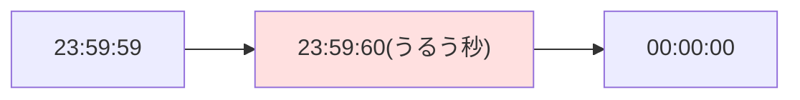

## このセクションで学ぶこと

- うるう秒とは何か、なぜ「23 時 59 分 60 秒」という時刻が挿入されるのか
- 2012 年 7 月 1 日、たった 1 秒の挿入で世界中のサービスが落ちた事件の顛末
- 「1 秒を 1 日かけて溶かす」という、うるう秒対策の発想の転換

## うるう年は知っていても、うるう秒は知らない

4 年に 1 度の 2 月 29 日は誰でも知っています。では「23 時 59 分 60 秒」という時刻が実在したことがある、と言われたらどうでしょうか。これが**うるう秒**です。

理由はシンプルで、**地球の自転は一定ではない**からです。私たちが使う**UTC**(協定世界時)は超高精度な原子時計をもとに刻まれていますが、地球の自転は潮汐や地球内部の変動の影響でわずかに揺らぎます。放っておくと「時計の正午」と「太陽が真上に来る時刻」が少しずつずれていくため、ずれが 0.9 秒以内に収まるように、国際機関(IERS)が「この日の最後に 1 秒足します」と世界に予告します。こうして 1972 年の運用開始以降、これまでに 27 回、1 秒が挿入されてきました。

人間にとっては「ふーん、1 秒ね」で終わる話です。ところがコンピュータにとって、**普段は存在しない時刻が突然現れる**のは大事件でした。

## 2012 年 7 月 1 日 — 世界中で同時多発的にサービスが落ちる

2012 年 6 月 30 日の深夜(UTC)、うるう秒が挿入された直後から、Reddit、Mozilla、LinkedIn など名だたるサービスが次々と不調に陥りました。オーストラリアではカンタス航空の予約・チェックインシステムが止まり、空港で多数の便が遅延。文字どおり「たった 1 秒」が現実世界の足を止めたのです。

犯人は、多くのサーバーが使っていた **Linux カーネルのバグ**でした。うるう秒で時刻を 1 秒戻す処理をしたとき、カーネル内部の高精度タイマー(hrtimer)が参照する基準値の更新が漏れていたのです。その結果、「指定時刻に起こして」と頼んでいた処理が予定より早く叩き起こされ続け、Java アプリケーションや MySQL などが無限の空回りに突入。CPU 使用率が一斉に張り付き、サービスが応答しなくなりました。

皮肉なことに、応急処置は拍子抜けするほど単純で、「システムの日付を設定し直す」だけ。時刻を設定し直すとカーネル内部の基準値が正しく更新され、空回りが止まったのです。世界中のエンジニアが休日の深夜に、この 1 行のコマンドを打って回りました。

## 1 秒を「溶かす」という発想 — leap smear

この種の障害を根本から避けるために Google が考えたのが **leap smear**(うるう秒の塗り伸ばし)です。「60 秒」という異常な時刻を出現させる代わりに、うるう秒の前後の長い時間をかけて、自社の時刻サーバーが配る 1 秒をほんのわずかずつ長くする。すると気づかないうちに合計 1 秒分のずれが吸収され、コンピュータは一度も「存在しない時刻」を見ずに済みます。

注意したいのは、これは「全員がそうしている」わけではないことです。塗り伸ばし中の時計は厳密には正しい時刻からずれているので、金融取引のように正確なタイムスタンプが求められる世界では採用しにくい面もあります。なお、うるう秒そのものが障害の温床だという認識は国際的にも共有され、2022 年の国際度量衡総会で **2035 年までにうるう秒の運用をやめる**方針が決議されました。「23 時 59 分 60 秒」は、近い将来、歴史上の珍事になる予定です。

## まとめ

- うるう秒は、地球の自転のゆらぎと原子時計のずれを埋めるために挿入される「23 時 59 分 60 秒」
- 2012 年には Linux カーネルのタイマー処理のバグを引き金に、Reddit や航空会社のシステムなどが同時多発的に障害を起こした
- Google の leap smear は 1 秒を長時間かけて溶かす対策で、うるう秒自体も 2035 年までに廃止される方針が決まっている
