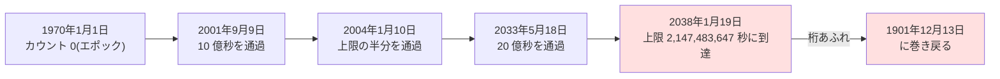

## このセクションで学ぶこと

- コンピュータが内部で時刻を「1970 年からの経過秒数」として数えていること
- 32bit の整数で秒を数えると、2038 年 1 月 19 日に「桁あふれ」が起きる理由
- 2038 年問題はどこに潜んでいて、どう対策されているのか

## コンピュータの時計は「ただのカウンター」

スマホの画面には「2026 年 6 月 13 日 14:30」のような時刻が表示されますが、コンピュータの内部に「年・月・日」という概念はほぼありません。内部で持っているのは、**ある起点からの経過秒数**というただの整数です。

この方式を **Unix 時間**(エポック秒)と呼びます。起点は **1970 年 1 月 1 日 0 時 0 分 0 秒(UTC)**。Unix という OS が開発された時代に「キリがよい近過去」として選ばれた日付で、この瞬間を**エポック**と呼びます。手元の Mac や Linux なら、いまの Unix 時間をすぐ確認できます。

```bash
$ date +%s
1781587800   # 1970 年からおよそ 17.8 億秒が経過している
```

「年月日 + 時分秒 + タイムゾーン」という人間向けの複雑な表現を捨てて、ただの 1 個の整数にする。時刻の比較は数の大小比較、経過時間は引き算で済む。これは見事な設計です。ちなみに前のセクションのうるう秒は、Unix 時間では**存在しないことにされています**(1 日はきっかり 86,400 秒として数える)。シンプルさのためにうるう秒を切り捨てた、という割り切りです。

## 整数には上限がある — 2038 年 1 月 19 日の崖

ところが、この「ただの整数」に落とし穴がありました。伝統的な C 言語のシステムでは、Unix 時間を **32bit の符号付き整数**で保持してきました。32bit 符号付き整数が表せる最大値は **2,147,483,647**。これを秒数として 1970 年から数えると、**2038 年 1 月 19 日 3 時 14 分 7 秒(UTC)**、日本時間では同日の昼 12 時 14 分 7 秒に到達します。



その 1 秒後に何が起きるか。カウンターは最大値を超えて**負の最大値に巻き戻り**、コンピュータの解釈では時刻が **1901 年 12 月 13 日**に飛びます。これが **2038 年問題**です。2000 年問題(Y2K)が「西暦下 2 桁」という表記の問題だったのに対し、こちらは整数の物理的な上限という、より根の深い問題です。

## 「2038 年はまだ先」ではない理由

注意したいのは、影響が 2038 年になってから始まるわけではないことです。たとえば「20 年後の満期日」を計算する金融システムは、2018 年の時点ですでに 2038 年以降の日付を扱う必要がありました。未来の日付を計算した瞬間にあふれるので、**問題は前倒しでやってくる**のです。

対策の本命は **64bit 化**です。64bit 整数なら西暦 3000 億年ごろまで表せるので、事実上の恒久対策になります。最近の OS やサーバーは 64bit 化が進み、Linux カーネルも 32bit 機向けの 64bit 時刻対応を済ませました。ただし本当の怖さは、家電・産業機器・自動車などに埋め込まれた、誰も更新しない 32bit の組み込みシステムです。データベースにも、日時型が 32bit 由来の「2038 年の壁」を引きずっているものが残っています。2038 年 1 月 19 日は平日の火曜日。その日、世界のどこかで 1901 年に戻る機械が必ず出る、と多くのエンジニアは見ています。

## まとめ

- コンピュータの時刻の正体は「1970 年 1 月 1 日(UTC)からの経過秒数」という 1 個の整数(Unix 時間)
- 32bit 符号付き整数の上限により、2038 年 1 月 19 日に桁あふれが起きて時刻が 1901 年に巻き戻る
- 対策の本命は 64bit 化だが、未来日付の計算では問題が前倒しで起き、更新されない組み込み機器に火種が残る
