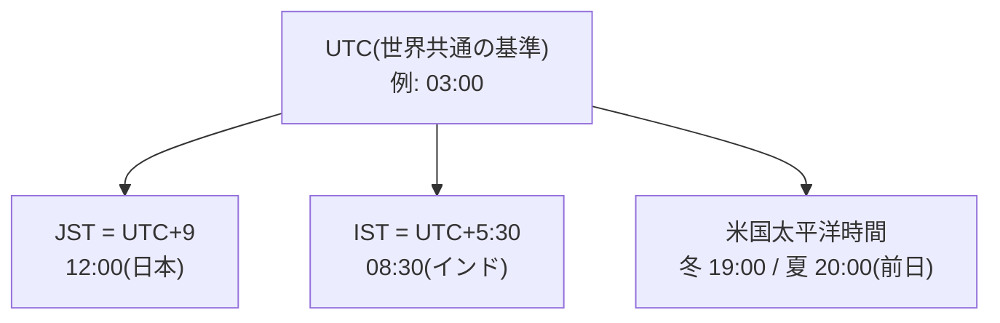

## このセクションで学ぶこと

- 世界共通の基準 UTC と、そこからの「ずらし」であるタイムゾーンの関係
- タイムゾーンの線引きが科学ではなく、政治と行政の都合で決まっていること
- 夏時間の切り替えが「存在しない時刻」と「2 回ある時刻」を生む仕組み

## 海外との打ち合わせ時間、何度計算しても自信がない

「サンフランシスコの 17 時って日本の何時?」— 指を折って数えて、答えが合っているか不安になる。あの面倒くささの根っこがタイムゾーンです。

仕組み自体は単純です。世界共通の基準時刻 **UTC** がまずあって、各地域はそこから何時間ずらすかを宣言しています。日本の **JST** は UTC+9、つまり「UTC より常に 9 時間先」。前のセクションで見たとおり、コンピュータの内部時刻(Unix 時間)は UTC 基準の 1 本だけで、画面に表示する瞬間に各地のずらし幅を足して見せている、という構造です。

## タイムゾーンは「人間の都合」の塊

ここからが雑学の本番です。タイムゾーンのずらし幅は「経度 15 度ごとに 1 時間」という理屈で始まりましたが、実際の線引きは**ほぼ政治と行政の都合**で決まっています。

- インドは UTC+5 **時間 30 分**。ネパールにいたっては UTC+5 時間 **45 分**です。「ずらし幅は 1 時間単位」という思い込みは世界では通用しません。
- 中国は東西 5,000km もあるのに、国全体が単一の標準時(UTC+8)です。西の端では時計の 10 時ごろにようやく日が昇ります。
- 2011 年、サモアは日付変更線の「東側」から「西側」へ移ることを決め、**12 月 30 日という日が丸ごと存在しない**まま年を越しました。貿易相手のオーストラリアと曜日を揃えるため、つまり経済の都合です。

こうした変更は各国政府が決め、ときに施行の数週間前に発表されます。世界中のコンピュータはこれにどう追従しているのか。答えは **tz データベース**という 1 つのデータベースです。IANA という組織が世界中のタイムゾーンと夏時間ルールの変更履歴を集めて管理しており、各国の「来月からルールを変えます」のたびに年に数回更新され、OS やスマホに配信されています。あなたのスマホが海外でも正しい時刻を出せるのは、この地道なデータベースのおかげです。

## 夏時間 — バグ製造機としての側面

タイムゾーンの中でも別格の厄介者が**夏時間**(DST)です。欧米の多くの地域では、春に時計を 1 時間進め、秋に 1 時間戻します。この切り替えの瞬間に、奇妙なことが起きます。

- **春**: 午前 2 時になった瞬間に午前 3 時へ飛ぶ。**「2 時 30 分」という時刻がその日には存在しない。**
- **秋**: 午前 2 時になった瞬間に午前 1 時へ戻る。**「1 時 30 分」がその日には 2 回ある。**

「毎日午前 2 時 30 分にバックアップを実行」と設定したらどうなるでしょう。春は 1 回スキップされ、秋は 2 回走るかもしれません。実害も繰り返し起きていて、たとえば 2010 年には iPhone の繰り返しアラームが夏時間の切り替えを正しく扱えず、欧州などで**アラームが 1 時間ずれて鳴る**バグが話題になりました。寝坊の犯人が夏時間だった、という人が大量発生したわけです。

なお日本にも 1948〜1951 年だけ夏時間が存在しましたが、不評ですぐ廃止されました。注意点として、「日本では関係ない」とは言い切れません。あなたの作った(使っている)サービスの利用者が夏時間のある国にいれば、その瞬間にバグは国境を越えてやってきます。

## まとめ

- タイムゾーンは UTC からの「ずらし」で、JST は UTC+9。コンピュータ内部は UTC の 1 本で動き、表示時に変換している
- ずらし幅や夏時間のルールは各国の政治・経済の都合で決まり、tz データベースが世界中の変更を追いかけている
- 夏時間は「存在しない時刻」と「2 回ある時刻」を毎年生み出す、時刻バグの代表的な温床
