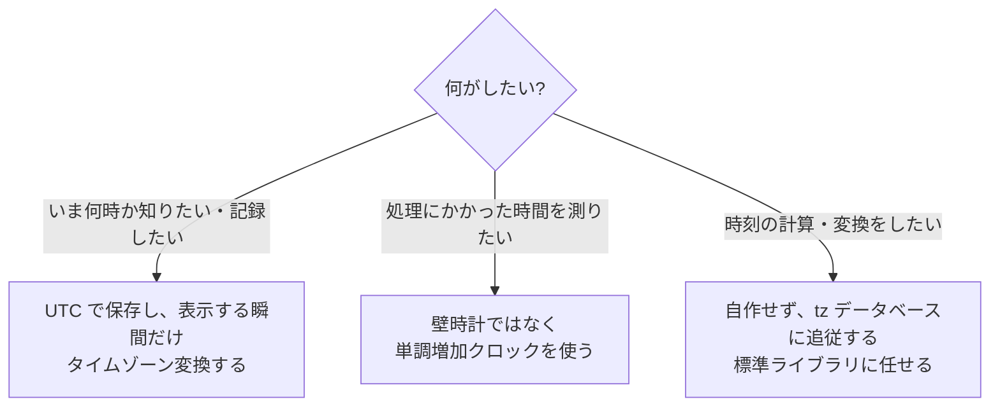

## このセクションで学ぶこと

- 時刻にまつわる「当たり前」が、世界規模ではことごとく崩れること
- 「時計は巻き戻る」ことを忘れた 1 行が大規模障害につながった実例
- エンジニアが守っている時刻処理の基本ルール(地雷原の歩き方)

## 「当たり前」が全部崩れる分野

この章で見てきたことを並べると、エンジニアが時刻処理を「地雷原」と呼ぶ理由が見えてきます。プログラマーが時刻について信じがちな思い込みは、たとえばこんなふうに崩れます。

- 「1 分は必ず 60 秒」→ うるう秒のある分は **61 秒**でした(01-01)
- 「1 日は必ず 86,400 秒」→ 夏時間の切り替え日は **23 時間や 25 時間**になります(01-03)
- 「タイムゾーンのずれは 1 時間単位」→ インドは 30 分、ネパールは 45 分ずれです(01-03)
- 「日付は必ず連続している」→ サモアでは 12 月 30 日が消えました(01-03)
- 「年月日と時分秒が分かれば瞬間が 1 つに決まる」→ 夏時間の秋の切り替えでは同じ時刻が 2 回あります(01-03)
- 「時計は前にしか進まない」→ これが次の事件の引き金です

どれも単体では雑学ですが、ソフトウェアはこうした前提の上に組まれているため、崩れた瞬間にバグとして噴き出します。

## 時計は巻き戻る — Cloudflare、年明けの 90 分

最後の「時計は前にしか進まない」を疑わなかったせいで起きた、教科書のような事件があります。2016 年の大晦日、年末にうるう秒が挿入された直後、世界中の Web サイトを支える Cloudflare の DNS サービスで障害が発生しました。

原因となったコードがやっていたのは、「応答にかかった時間 = 今の時刻 − 開始時刻」というごく普通の引き算です。ところが、うるう秒の処理でサーバーの時計がわずかに巻き戻り、この引き算の結果が**負の数**になりました。「経過時間がマイナス」という想定外の値を受け取った後続の処理が異常終了し、一部の DNS 解決が失敗。影響は約 90 分続きました。

ここから生まれた教訓が、**時計は 2 種類ある**という考え方です。

- **壁時計**: 「いま何時か」を示す時計。NTP による時刻合わせやうるう秒で、進んだり**巻き戻ったり**する。
- **単調増加クロック**: 起動からの経過だけをひたすら数えるカウンター。何時かは分からないが、**絶対に巻き戻らない**。

「いま何時?」には壁時計を、「どれだけ時間がかかった?」には単調増加クロックを使う。この使い分けが、現代のプログラミング言語では標準機能として用意されています。

## 地雷原の歩き方 — 先人がたどり着いた基本ルール

では、エンジニアは恐れながらどう歩いているのか。先人が血を流してたどり着いたルールは、おおむね次の 3 つに集約されます。

第一に、**記録は UTC で**。サーバー内部やデータベースには UTC で保存し、人間に見せる最後の瞬間だけタイムゾーン変換する。第二に、**経過時間は単調増加クロックで**。Cloudflare の事件の再発防止はこれです。第三に、**時刻計算を自作しない**。「ある日付の 1 か月後」のような一見簡単な計算にも、うるう年・月末・夏時間が絡みます。tz データベースに追従している標準ライブラリに任せるのが唯一の正解です。

注意点をひとつ。これらを守っても完璧にはなりません。たとえば「2030 年の元日にアラームを鳴らす」という未来の予定は、それまでにその国がタイムゾーンのルールを変えたら計算が狂います。時刻処理に「完全勝利」はなく、被害を最小化する歩き方があるだけ — だからエンジニアは今日も時刻を恐れるのです。

## まとめ

- 「1 日は 86,400 秒」「時計は前にしか進まない」といった直感は、うるう秒・夏時間・時刻合わせの前で崩れる
- 経過時間の引き算が負になった Cloudflare の障害が示すとおり、「いま何時」は壁時計、「どれだけ経った」は単調増加クロックと使い分ける
- 基本ルールは「UTC で保存・表示時に変換」「経過時間は単調増加クロック」「時刻計算は標準ライブラリに任せる」の 3 つ
