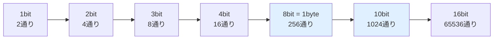

## このセクションで学ぶこと

- コンピュータの最小単位「ビット」と、8bit = 1byte の関係
- 256 や 1024 がコンピュータにとって「キリのいい数字」である理由
- 身の回りに潜む 255・256 の正体(RGB、IP アドレス、ゲームのバグ)

## ゲームの上限はなぜ「255」なのか

古いゲームで、アイテムの所持数が 255 個でぴたりと止まる。画像編集ソフトで色を指定すると、赤・緑・青の値はそれぞれ 0〜255。自宅の Wi-Fi ルータの管理画面は 192.168.0.1。——どうしてコンピュータの世界は、100 や 1000 ではなく、255 とか 256 とか 1024 とか、中途半端に見える数字だらけなのでしょうか。

種明かしをすると、これらはぜんぶ **2 のべき乗**(2 を何回も掛けた数)に由来します。コンピュータにとっては 1000 のほうがよほど中途半端で、256 や 1024 こそが「キリのいい数字」なのです。

## ビットの倍々ゲーム

コンピュータが扱える情報の最小単位は **ビット(bit)** です。1 ビットで表せるのは「0 か 1 か」のたった 2 通り。ところが、ビットを 1 本増やすごとに、表せるパターンの数は**倍**になります。

8 ビットを束ねると 2 の 8 乗で **256 通り**。この「8 ビットのまとまり」を**バイト(byte)** と呼びます。実は昔のコンピュータには 6 ビットや 9 ビットをひとまとまりにする機種もあったのですが、1964 年に登場した IBM System/360 が 8 ビットを採用して大成功を収めたことで、**8bit = 1byte** が事実上の世界標準になりました。英数字 1 文字を収めるのにちょうどよいサイズだった、という事情もあります。

ここで数え方に注意が要ります。256 通りで表せるのは「0 から 255 まで」。**0 を含むので、最大値は 256 ではなく 255** です。ゲームの所持数が 255 で止まるのは、その数をちょうど 1 バイトで管理しているからなのです。

## 身の回りの 255・256 を探す

- **RGB カラー**: 画面の色は赤・緑・青の光の強さの組み合わせで、各色を 1 バイト(0〜255)で表します。Web の色指定「#FF0000」の FF は、16 進数で 255 のことです。
- **IPv4 アドレス**: 192.168.0.1 のような IP アドレスは「0〜255 の数字 4 つ」の組です。区画ひとつが 1 バイトだから、この範囲になります。
- **パックマンの 256 面バグ**: 1980 年のパックマンは面数を 1 バイトで数えていたため、256 面に達するとカウンターが桁あふれを起こし、画面の右半分が文字化けしてクリア不能になります。第 1 章で見た 2038 年問題と同じ「カウンターの限界」が、ゲームの世界では 40 年以上前に現実になっていたわけです。

そして 2 を 10 回掛けた **1024** は、人間の「キリのいい」1000 にいちばん近い 2 のべき乗です。この絶妙な近さが、次のセクションで見る「1KB は 1000 バイトか 1024 バイトか」という長い混乱の火種になりました。

## まとめ

- コンピュータの最小単位はビット(0 か 1)。1 本増えるごとに表せるパターンが倍になる
- 8 ビット = 1 バイトで 256 通り。0 から数えるので最大値は 255(RGB や IPv4 アドレスがこの範囲)
- 1024(2 の 10 乗)は 1000 に近い 2 のべき乗で、これが単位の混乱(次セクション)の伏線になる
