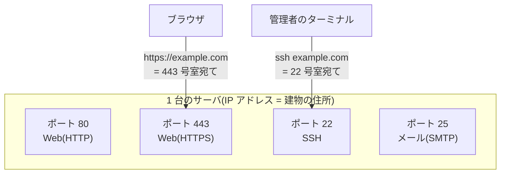

## このセクションで学ぶこと

- ポート番号が「建物の部屋番号」にあたる仕組みであること
- 80(HTTP)・443(HTTPS)・22(SSH)など well-known port の意味と由来
- URL にポート番号が見えないのは「省略されているだけ」であること

## 「:8080」の正体

社内システムの URL の末尾に「:8080」という数字が付いていたり、エラー画面に「ポート 443 に接続できません」と表示されたり。Web を使っていると、ときどき正体不明の数字に出くわします。この数字、実はインターネットの通信すべてに毎回登場している「部屋番号」です。

## 住所だけでは荷物は届かない

ネットワーク上のコンピュータには **IP アドレス**という住所があります。ところが 1 台のコンピュータの中では、Web サーバ、メールサーバ、遠隔操作の窓口……と複数のプログラムが同時に通信を待っています。住所だけでは「建物」までしか荷物が届きません。そこで部屋番号の役割を果たすのが**ポート番号**です。

ポート番号は **16 ビット**の数値です。前々セクションの倍々ゲームを思い出してください。16 ビットで表せるのは 65,536 通り。つまりポート番号は **0〜65535** の範囲と決まっています。ここにもまた 2 のべき乗が顔を出しているわけです。

## 番号は誰が決めたのか — well-known port

このうち 0〜1023 番は **well-known port**(よく知られたポート)と呼ばれ、IANA という組織が「この番号はこの用途」という対応表を管理しています。代表的な顔ぶれはこのあたりです。

- **80 番 = HTTP**(Web)
- **443 番 = HTTPS**(暗号化された Web)
- **22 番 = SSH**(サーバの遠隔操作)
- **25 番 = SMTP**(メール送信)
- **53 番 = DNS**(ドメイン名から IP アドレスを引く)

では、なぜ Web は「80」なのでしょうか。実は深い意味はありません。HTTP が登場した 1990 年代初頭、当時の割り当て表で空いていた番号が振られただけです。443 も同様で、暗号化版の登録を申請したときに空いていたから 443 になりました。

一方、**22 番の SSH には「狙って取った」逸話**があります。SSH の作者タトゥ・ユレネン(Tatu Ylönen)は 1995 年、暗号化なしの遠隔操作(Telnet、23 番)とファイル転送(FTP、21 番)を置き換えるツールとして SSH を開発しました。そして「置き換えたい 2 つのちょうど間の 22 番が空いている」と気付き、その番号の割り当てを申請したのです。出来すぎなほど収まりのいい部屋番号です。

## 注意点 — 見えないだけで、いつも使っている

ブラウザで https://example.com を開くとき、URL にポート番号は見えませんが、実際には **443 番が省略されている**だけです(http なら 80 番)。「:8080」のような表示は、既定ではないポートを使っているために省略できず表に出てきた、というだけのこと。8080 が選ばれがちなのは「80 の代理」という語呂の慣習です。また Unix 系 OS には、1023 番以下のポートを使うのに管理者権限が必要という伝統があります。開発中のテストサーバが 3000 番や 8080 番を名乗るのは、このためでもあります。

## まとめ

- IP アドレスが建物の住所、ポート番号が部屋番号。16 ビットなので 0〜65535 の範囲になる
- 0〜1023 番は well-known port として IANA が管理。80 = HTTP、443 = HTTPS、22 = SSH など
- URL にポートが見えないのは既定ポート(80/443)が省略されているだけで、通信では常に使われている
