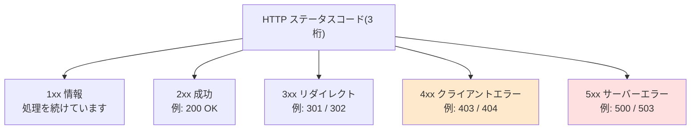

## このセクションで学ぶこと

- 404 や 200 などの 3 桁の数字に隠された「文法」
- 1xx〜5xx の 5 つのクラスがそれぞれ何を意味するか
- 「404 は CERN の部屋番号」という有名な都市伝説の真相

## エラーページの数字は、実は読める

リンクをクリックしたら「404 Not Found」。Web を使っていれば誰でも出会ったことのある画面です。では、なぜ「404」なのでしょうか。設計者がサイコロでも振って決めたのでしょうか。

実はこの 3 桁には、きちんとした**文法**があります。ブラウザがページをリクエストすると、サーバーは必ず 3 桁の数字 — **HTTP ステータスコード** — を添えて返事をします。普段ページが正常に表示されているときも、裏では「200 OK」という数字が返ってきています。エラーのときだけ数字が画面に顔を出すので、私たちは 404 ばかり覚えてしまうのです。

## 先頭の 1 桁がすべてを決める

3 桁は通し番号ではありません。**先頭の 1 桁が結果の大分類(クラス)、残りの 2 桁が詳細**を表します。

覚え方はシンプルです。**2xx は「成功」、3xx は「他をあたって」、4xx は「あなた(リクエスト側)のせい」、5xx は「こちら(サーバー側)のせい」**。この設計のうまさは、機械が先頭 1 桁だけ見れば対応を決められることにあります。実際 HTTP の仕様には「知らないコードを受け取ったら、そのクラスの代表(400 や 500 など)として扱ってよい」というルールがあり、将来新しいコードが増えても古いソフトが壊れないようになっています。番号体系そのものが、未来の実装者へ向けた設計者のメッセージなのです。

ちなみに「3 桁の応答コード」は HTTP の発明ではありません。それ以前からファイル転送の FTP やメールの SMTP が 3 桁コードで会話しており、Tim Berners-Lee らが設計した HTTP はその伝統を受け継ぎました。HTTP のコード体系は 1996 年の RFC 1945(HTTP/1.0)で正式に文書化され、現在は 2022 年の RFC 9110 が最新の正本です。

## 404 を分解する — そして都市伝説

文法が分かれば 404 も読めます。先頭の「4」はクライアントエラー、つまり「リクエストの内容に問題がある」クラス。残りの「04」はその中の連番で、400 Bad Request(リクエストが壊れている)、401 Unauthorized(認証が必要)、403 Forbidden(権限がない)に続く 4 番目が「404 = 指定された場所に何もない」でした。つまり由来は拍子抜けするほど事務的な連番です。

有名な「404 は CERN(Web 発祥の研究所)の 404 号室にサーバーがあったから」という物語は、初期の Web 開発に関わった当事者たちが否定している後付けの都市伝説です。話としては魅力的ですが、真相は「4 クラスの 4 番目」にすぎません。

注意したいのは、404 が常に正直とは限らないことです。たとえば GitHub は、権限のない非公開リポジトリへのアクセスに 403 ではなく 404 を返します。「存在するが見せられない」と答えるとリポジトリの存在自体が漏れるため、あえて「見つからない」と答えるのです。また「以前はあったが意図的に消した」ことを伝える 410 Gone という別のコードも用意されています。エラー番号は単なる記号ではなく、**何をどこまで相手に伝えるかという設計判断の表現**でもあるのです。

## まとめ

- ステータスコードは「先頭 1 桁 = クラス、残り 2 桁 = 詳細」という文法を持ち、4xx はクライアント側、5xx はサーバー側の問題を表す
- 404 の由来は 400・401・403 に続く事務的な連番で、「CERN の 404 号室」は当事者が否定している都市伝説
- GitHub が非公開リポジトリに 404 を返すように、どの番号を返すか自体が「何を伝えるか」という設計判断になっている
