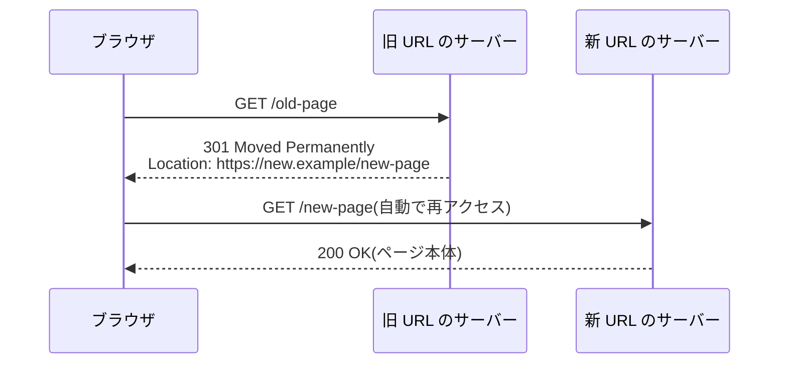

## このセクションで学ぶこと

- 古い URL から新しいページへ自動で飛ばされる「リダイレクト」の正体
- 301(恒久的な引っ越し)と 302(一時的な案内)の使い分け
- 302 が「Found」という変な名前になった、仕様が現実に折れた歴史

## 気づかないうちに「引っ越し通知」を受け取っている

何年も前のブックマークを開いたのに、ちゃんとリニューアル後の新しいサイトにたどり着いた — そんな経験はないでしょうか。これは偶然ではなく、旧 URL のサーバーが「**引っ越しました。新しい住所はこちらです**」という返事を返しているからです。これが 3xx クラス、**リダイレクト**です。

仕組みは郵便の転送サービスによく似ています。ブラウザが旧 URL にアクセスすると、サーバーは 3xx のコードと **Location ヘッダー**(新しい行き先の URL)を返し、ブラウザは黙ってそちらに再アクセスします。利用者には一瞬の出来事ですが、裏では 2 往復の会話が起きています。

## 301 と 302 — 「住所録を書き換えて」と「今だけこっち」

リダイレクトの 2 大スターが 301 と 302 です。**301 Moved Permanently** は「恒久的に引っ越しました。あなたの住所録を書き換えてください」。**302 Found** は「今だけ別の場所に案内します。正式な住所は元のままです」。

この違いが効く相手は、人間ではなく機械です。ブラウザは 301 を覚え込み(キャッシュし)、次回からは旧 URL に聞きにも行かず直接新 URL へ向かいます。検索エンジンは 301 を見ると、旧 URL が長年積み上げた評価やリンクの蓄積を新 URL に引き継ぎ、検索結果の表示も差し替えます。302 ならどちらも起こらず、元の URL が正式な住所のまま残ります。たとえば「http で来た人を https に統一する」のは典型的な 301、「キャンペーン期間中だけ特設ページへ飛ばす」「メンテナンス中だけ案内ページへ誘導する」のは 302 の出番です。

## 「Found」という変な名前に刻まれた歴史

ところで 302 の正式名「Found(見つかった)」は、よく考えると意味不明です。実はこれ、**仕様がブラウザの現実に折れた跡**なのです。1996 年の RFC 1945(HTTP/1.0)で 302 は「Moved Temporarily(一時的に移動)」という素直な名前でした。仕様上、リダイレクト先へはリクエストの種類(メソッド)を変えずにアクセスすべきでしたが、当時のブラウザの多くは 302 を受けると POST(データ送信)を勝手に GET(取得)に変えて再送していました。

1999 年の RFC 2616(HTTP/1.1)はこの現実を追認します。302 を「Found」という当たり障りのない名前に変え、代わりに「GET に変えてよい」と明言する 303 See Other と、「メソッドを変えてはいけない」と明言する 307 Temporary Redirect を新設したのです。さらに 2015 年の RFC 7538 で 301 の厳格版である 308 Permanent Redirect が追加され、表が完成しました。番号と名前の不揃いさは、設計者と実装者の長い対話の議事録というわけです。

注意点をひとつ。**301 は取り消しがとても難しい**。ブラウザに強くキャッシュされるため、間違えて 301 を設定すると、サーバー側で直しても利用者の手元のブラウザは古い転送先を覚え続けます。実務では「迷ったらまず 302 で様子を見て、確信してから 301 に昇格する」が定石です。

## まとめ

- リダイレクトは 3xx + Location ヘッダーによる「引っ越し通知」で、ブラウザが自動的に新しい URL へ再アクセスする
- 301 は恒久的な引っ越し(検索エンジンが評価を引き継ぐ)、302 は一時的な案内(元の URL が正式なまま)
- 302 の名前「Found」はブラウザの実装に仕様が折れた歴史の跡で、301 は強くキャッシュされるため「迷ったら 302 から」が定石
