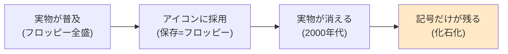

## このセクションで学ぶこと

- 保存アイコンの元ネタ「フロッピーディスク」がどんなメディアだったか
- 実物が消えても記号だけが生き残る「記号の化石化」という構造
- 電話・封筒・虫眼鏡——身の回りにひそむ他の「化石アイコン」

## その四角いアイコン、実物を見たことがありますか

文章を書き終えて、画面の隅の四角いアイコンをクリックして保存する。誰もが毎日のようにやっている操作ですが、あの四角の正体を考えたことはあるでしょうか。あれは**フロッピーディスク**——1980〜90 年代にデータの持ち運びを一手に引き受けていた記録メディアです。2000 年代以降に生まれた世代の多くは、実物に一度も触れたことがないまま、毎日このアイコンを押しています。

フロッピーディスクは、磁性体を塗った薄い円盤をプラスチックのケースに収めたメディアです。保存アイコンのモデルになった 3.5 インチ版の容量は約 1.44MB。スマートフォンで撮った写真 1 枚すら入らないサイズですが、当時は論文もゲームも住所録も、すべてこの「ペラペラの四角」で運ばれていました。やがて CD-R や USB メモリ、そしてクラウドの普及で役目を終え、日本では 2011 年に主要メーカーの生産が終了しています。

## 実物は消えても、記号は生き残る

初期の GUI(グラフィカルな画面)は、コンピュータに不慣れな人でも直感的に操作できるよう、**机の上にある実物**を画面に再現しました。書類はフォルダに、不要なファイルはゴミ箱に、データの保存はフロッピーに。こうした「現実の物まね」のデザイン手法を**スキューモーフィズム**と呼びます。

面白いのはここからです。フロッピーという実物が市場から消えても、「保存=あの四角」という対応関係だけは何十億人の頭に深く刻まれ、アイコンは現役のまま残りました。元ネタが滅びたのに記号だけが意味を保って生き続ける——この現象を、本章では**記号の化石化**と呼ぶことにします。

つまり保存アイコンは、デザイナーが「変えそびれた」わけではありません。世界中の人が共有する「保存と言えばこの形」という巨大な資産を捨ててまで、新しい絵柄を全員に学習し直させるコストに見合わないから、あえて残されているのです。実際、保存アイコンの刷新案はこれまで何度も議論されてきましたが、フロッピーを超える「全員に通じる形」は現れていません。

## 化石アイコンはほかにもある

一度気づくと、画面の中は化石だらけです。

- **電話アイコン**: 固定電話の受話器の形。受話器を持ったことのない世代にも通じます
- **メールアイコン**: 紙の封筒。電子メールで封筒を使うことは一度もありません
- **カメラのシャッター音**: 物理的なシャッター機構が立てていた音の「音の化石」です
- **虫眼鏡=検索**: 紙の資料を虫眼鏡で調べた時代のメタファーです

注意したいのは、化石化は「悪いこと」ではないという点です。記号の役目は実物を正確に描写することではなく、**見た全員が同じ意味を瞬時に思い浮かべられること**にあります。元ネタを知らなくても意味が通じるなら、その記号は道具として完璧に機能しています。むしろ「正確さ」を求めて頻繁にアイコンを変えるほうが、ユーザーの学習を無駄にしてしまうのです。

## まとめ

- 保存アイコンの元ネタは 3.5 インチのフロッピーディスクで、容量は約 1.44MB しかなかった
- 実物が消えても記号が意味を保って残る現象が「記号の化石化」で、スキューモーフィズム時代の名残でもある
- 電話・封筒・虫眼鏡など化石アイコンは身近に多く、「全員に通じること」こそが記号の価値である
