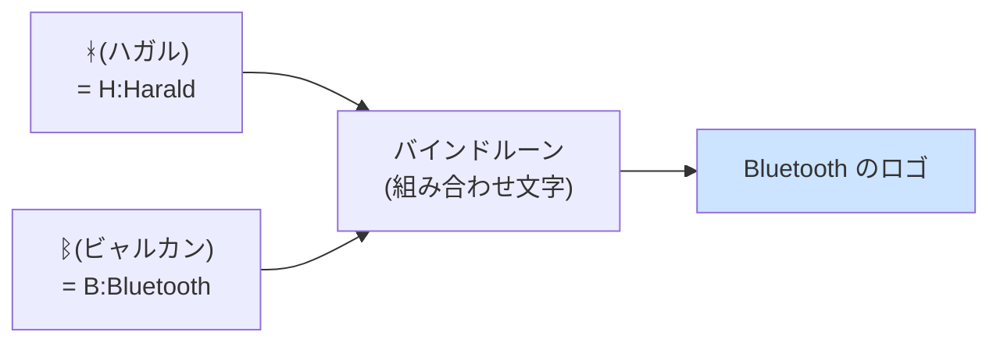

## このセクションで学ぶこと

- Bluetooth の名前の由来になった、10 世紀デンマークの王「青歯王ハーラル」
- ロゴの正体が、ルーン文字 2 つを組み合わせた「王のイニシャル」であること
- 開発コードネームがそのまま正式名称になってしまった意外な経緯

## イヤホンをつなぐたびに、王様の名を呼んでいる

ワイヤレスイヤホン、マウス、スマートウォッチ。「Bluetooth で接続」という操作を、私たちは 1 日に何度も行います。しかし冷静に考えると不思議な名前です。青い歯?なぜ無線技術が?

答えは約 1000 年前のデンマークにあります。Bluetooth は、10 世紀のデンマーク王**ハーラル・ゴームソン**のあだ名「青歯王」(デンマーク語で Blåtand、英語に直すと Bluetooth)から取られました。ハーラル王は、分裂していたデンマークの諸勢力を統一し、さらにノルウェーにも支配を広げた実在の人物です。「青歯」というあだ名の由来ははっきりしていませんが、死んだ歯が青黒く変色して見えたから、という説がよく知られています。

## 「規格の乱立」を「部族の統一」にたとえた

1990 年代後半、Intel・Ericsson・Nokia などの各社は、それぞれ別々に短距離無線の技術を開発していました。このままでは規格が乱立して、メーカーが違う機器同士はつながらない——そこで各社が手を組み、統一規格を作るプロジェクトが動き出します。

Intel のエンジニアだったジム・カーダック(Jim Kardach)は、Ericsson の技術者とヴァイキングの歴史小説を話題にしたのをきっかけに、ハーラル王の逸話を知ります。「バラバラだった部族を 1 人の王が統一したように、バラバラの通信規格を 1 つにまとめる」。この気の利いた対応関係が気に入られ、プロジェクトのコードネームは Bluetooth に決まりました。

ただし、これはあくまで開発中の仮の名前でした。正式名称の候補には「PAN」や「RadioWire」が挙がっていたのです。ところが商標調査の結果、PAN はすでにあちこちで使われていて商標として弱く、RadioWire は調査が発表に間に合わない。消去法で、コードネームの Bluetooth がそのまま世に出ることになりました。冗談半分の仮名が、いまや世界中の機器に刻まれているわけです。

## ロゴは王のイニシャルのルーン文字

Bluetooth のロゴをよく見てください。あのギザギザした記号は、ヴァイキング時代の北欧で使われた**ルーン文字**を 2 つ重ねたものです。

ハーラル(Harald)の頭文字 H にあたるルーン「ᚼ(ハガル)」と、青歯(Bluetooth)の B にあたる「ᛒ(ビャルカン)」。この 2 文字を 1 つに重ねた**バインドルーン**(組み合わせ文字)が、そのままロゴになっています。つまりあのマークは電波や接続を図案化したものではなく、**1000 年前の王様のイニシャルのサイン**なのです。

注意点をひとつ。「青歯王にちなんでロゴも青い」と言いたくなりますが、王の歯の色とブランドカラーの青に直接の関係があるわけではありません。また、由来は冗談めいていても、Bluetooth は Bluetooth SIG という標準化団体がいまも仕様を管理する、れっきとした国際的な標準規格です。名前の軽さと技術の真面目さのギャップも、この規格の魅力と言えるでしょう。

## まとめ

- Bluetooth の名前は、デンマークを統一した 10 世紀の王「青歯王ハーラル」のあだ名に由来する
- 「規格の乱立を統一する」というプロジェクトの目的を、部族を統一した王にたとえたコードネームが正式名称として残った
- ロゴはハーラル王のイニシャル H・B にあたるルーン文字 2 つを重ねたバインドルーンである
