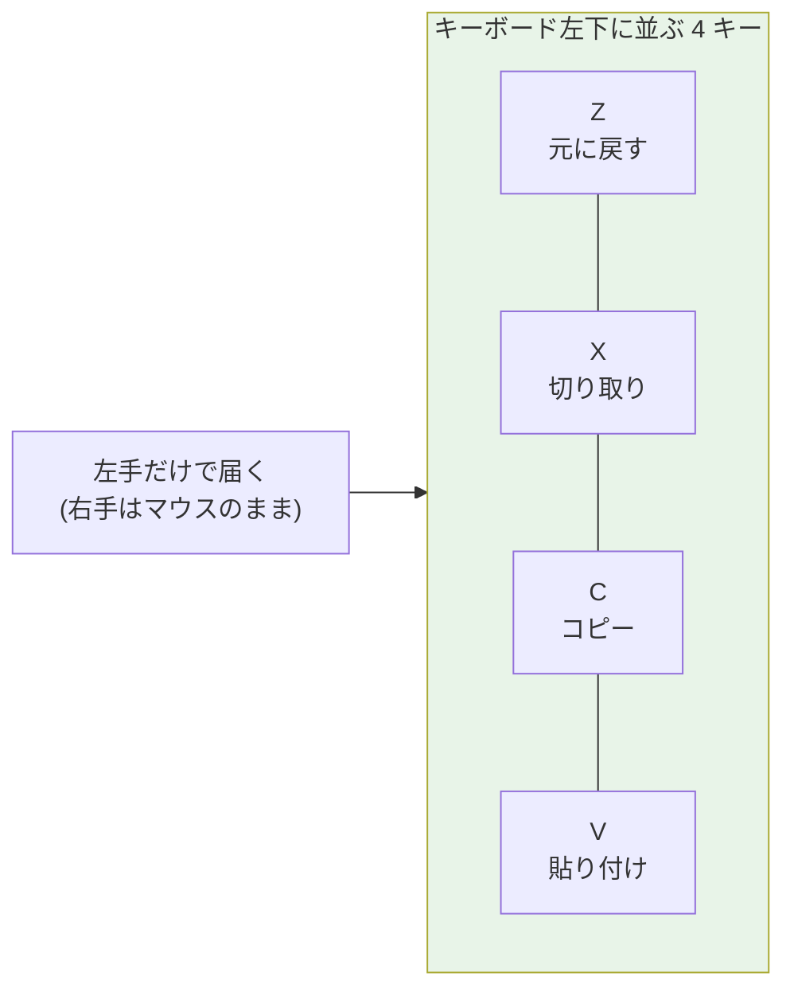

## このセクションで学ぶこと

- 「コピペ」を発明した Larry Tesler と、モードレス編集という考え方
- Ctrl+C/V/X/Z が文字の意味ではなく「キーの位置」で選ばれた理由
- 三本線の「ハンバーガーメニュー」が実は 1981 年生まれだという事実

## コピペには発明者がいる

Ctrl+C で写して、Ctrl+V で貼る。1 日に何十回と繰り返すこの操作はあまりに自然で、「誰かが発明したもの」だとは想像しにくいかもしれません。しかしコピペには、はっきりと発明者がいます。Xerox のパロアルト研究所(PARC)にいた **Larry Tesler**(ラリー・テスラー)です。

1970 年代半ば、Tesler は同僚の Tim Mott とともに **Gypsy** というテキストエディタを開発し、そこに**カット&ペースト**を実装しました。名前の由来は紙の編集作業そのものです。当時の出版の現場では、原稿をハサミで切り、並べ替えて糊で貼り直すのが日常でした。その手作業の比喩を、そのまま画面の中に持ち込んだのです。

Tesler がこだわったのが**モードレス編集**でした。当時のエディタは「挿入モード」「コマンドモード」といった状態を切り替えて使うのが普通で、同じキーを押しても、いまどのモードにいるかで結果が変わります。これが初心者のつまずきの最大の原因でした。Tesler は「ユーザーをモードに閉じ込めるな」を信条にし、自家用車のナンバープレートに「NO MODES」と掲げたほどの徹底ぶりです。彼は 1980 年に Apple へ移り、この思想は Lisa や Macintosh の GUI に流れ込んでいきました。

## なぜ C と V なのか — 意味ではなく「位置」

コピーの C は分かるとして、貼り付けはなぜ V なのでしょうか。Paste の P ではだめだったのでしょうか。実は、これらのキーは**文字の意味では選ばれていません**。決め手は、Z・X・C・V がキーボードの左下に一列に並んでいることでした。

この割り当てを標準化したのは Apple の Lisa(1983 年)と Macintosh(1984 年)です。右手でマウスを握ったまま、左手だけで修飾キーと隣り合う 4 つのキーに届く。「元に戻す・切り取り・コピー・貼り付け」という最頻出の 4 操作を、視線を落とさず片手で連打できる配置だったのです。のちに Windows もこの割り当てを取り込み、Ctrl+Z/X/C/V は事実上の世界標準になりました。

後付けの覚え方として「X はハサミの形」「V は校正記号の挿入マーク」と説明されることもありますが、文字と操作が素直に対応しているのは Copy の C くらいです。前のセクションで見た QWERTY と同じように、ここでも「配置」という物理的な都合が操作の標準を決めた、というわけです。

## 三本線のメニューは 1981 年生まれ

スマホアプリの隅にある三本線のアイコン、通称**ハンバーガーメニュー**。いかにもスマホ時代の発明に見えますが、生まれたのは 1981 年です。Xerox が発売した、商用マシンとして初めて本格的な GUI を備えた **Xerox Star** のために、デザイナーの **Norm Cox** が描きました。三本線は「項目が縦に並んだリスト」を抽象化した形で、当時の粗い画面でも潰れずに表示できるシンプルさが持ち味でした。その後、画面の大型化とともに一度はほぼ姿を消しますが、スマートフォンの登場で「狭い画面にメニューを畳み込みたい」というニーズが戻ってくると、約 30 年の時を超えて再発掘され、世界中のアプリに広がりました。

注意点をひとつ。同じ Ctrl+C でも、ターミナル(黒い画面)では「コピー」ではなく「実行中のプログラムの中断」を意味します。こちらは GUI より古いテレタイプ時代からの伝統で、由来の違う 2 つの文化が、たまたま同じキーの組み合わせに同居しているのです。ターミナルで文字をコピーしたつもりが処理を止めてしまった——というのは、いまでも新人エンジニアの通過儀礼になっています。

## まとめ

- カット&ペーストは Xerox PARC の Larry Tesler らが Gypsy エディタで生んだ操作で、原稿をハサミと糊で組み替える紙の編集作業が名前の由来
- Ctrl+Z/X/C/V は文字の意味ではなく、「左下に並んでいて左手だけで押せる」というキーの位置で選ばれた
- ハンバーガーメニューは 1981 年の Xerox Star のために Norm Cox がデザインし、スマートフォン時代に再発掘された
