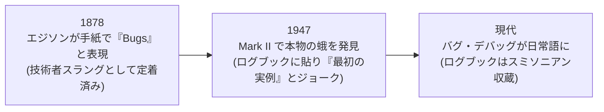

## このセクションで学ぶこと

- 「世界初のバグ」として語り継がれる、1947 年の本物の蛾の事件
- 実は「バグ」という言葉は蛾より先にあった — エジソンも使っていた
- 逸話を広めたグレース・ホッパーという人物のすごさ

## リレーに挟まっていた 1 匹の蛾

「プログラムにバグがある」— エンジニアでなくても聞いたことのある表現だと思います。バグ(bug)は英語で「虫」。でも、なぜ不具合が「虫」なのでしょうか。実はこの言葉には、**本物の虫が計算機に挟まっていた**という出来すぎた逸話があります。

1947 年 9 月 9 日、ハーバード大学で稼働していた電気機械式計算機 **Mark II** が動作不良を起こしました。当時のコンピュータは「リレー」と呼ばれる電磁式スイッチがカチカチと物理的に開閉して計算する機械です。原因を調べていたオペレーターたちは、70 番リレーの接点に **1 匹の蛾**が挟まって死んでいるのを発見しました。接点に虫が挟まれば、スイッチは正しく閉じません。文字どおり「虫のせいで」計算機が誤動作していたのです。

チームはこの蛾をピンセットで取り出し、セロハンテープで**ログブック(作業日誌)に貼り付け**、こう書き添えました。「**First actual case of bug being found**(バグが実際に発見された最初の事例)」。蛾が貼られたこの日誌のページは現存し、今もワシントンの**スミソニアン博物館**(国立アメリカ歴史博物館)に収蔵されています。

## オチが先にあった — 「バグ」はエジソンも使っていた

ここで面白いのは、この書き込みが**ジョークだった**ことです。「バグ=機械の不具合」という言い回しは、実はこの事件のずっと前から技術者のスラングとして存在していました。だからこそ「(比喩じゃなく)本物のバグが見つかった最初の事例」という一文が効いてくるわけです。

たとえば発明王**トーマス・エジソン**は、1878 年の手紙の中で、発明につきものの小さな欠陥や困難のことを「Bugs と呼ばれているもの」と書いています。19 世紀の電信・電話の技術者たちの間で、機械の不調を「バグ」と呼ぶ文化はすでにあったのです。

## 逸話を伝説にした人 — グレース・ホッパー

この話とセットで語られるのが**グレース・ホッパー**です。彼女は Mark II の開発チームに在籍していた計算機科学者で、この逸話を講演のたびに楽しそうに語り、世界中に広めました(蛾を見つけたのは当直のオペレーターで、彼女自身ではなかったとされています)。

ホッパーの本当のすごさは蛾の話の外にあります。彼女は 1952 年に**世界初のコンパイラ**(人間が書いたコードを機械語に翻訳するプログラム)を開発し、「英語に近い言葉でプログラムを書く」という当時は笑われた発想を実現して、後のプログラミング言語 **COBOL** の設計に大きな影響を与えました。米海軍では准将まで昇進し、「アメイジング・グレース」の愛称で呼ばれた伝説的人物です。**デバッグ**(虫取り=バグ修正)という言葉が広く定着したのも、彼女たちの逸話の影響が大きいと言われます。

注意したいのは、「ホッパーがバグという言葉を発明した」という俗説は**正確ではない**ことです。言葉自体は前からあり、彼女たちは「広めた」側。また、この事件は「1945 年」と誤記されることも多いのですが、ログブックの日付は **1947 年 9 月 9 日**です。雑学として人に話すときは、ここを押さえておくと一段強くなれます。

## まとめ

- 1947 年、ハーバードの Mark II のリレーに本物の蛾が挟まり、チームはログブックに貼って「バグが実際に発見された最初の事例」と記録した
- 「バグ=不具合」という言葉自体は 19 世紀からあり、エジソンも 1878 年の手紙で使っていた
- グレース・ホッパーはこの逸話を広めた人物であり、世界初のコンパイラ開発や COBOL への貢献で知られる計算機科学の巨人でもある
