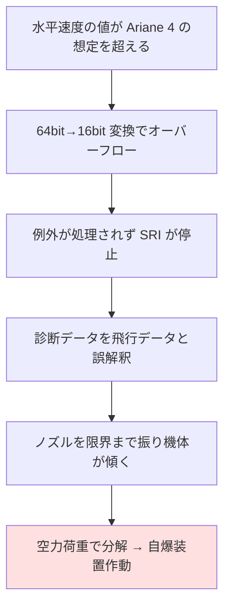

## このセクションで学ぶこと

- 1996 年、欧州の新型ロケット Ariane 5 が初飛行のわずか 40 秒後に自爆した事件
- 直接の原因は「64bit の数値を 16bit に変換したら溢れた」というたった 1 か所の処理
- 「Ariane 4 で実績のあるコード」がなぜ Ariane 5 を落としたのか

## 打ち上げ 40 秒で消えた 10 年の開発

1996 年 6 月 4 日、南米・仏領ギアナのクールー宇宙センター。欧州宇宙機関(ESA)が約 10 年をかけて開発した新型ロケット **Ariane 5** が、初飛行(フライト 501)に飛び立ちました。ところが打ち上げから約 37 秒後に異常が始まり、機体は突然進路を外れて横倒しに。空力で分解が始まり、約 40 秒後には自爆装置が作動して、科学衛星クラスター 4 機もろとも空中で火の玉になりました。損失額は**約 3 億 7000 万ドル**とも言われ、「史上最も高くついたソフトウェアバグ」の代表例として語り継がれています。

爆発の引き金は、ハードウェアの故障ではありません。ロケットの姿勢と速度を測る**慣性基準装置(SRI)**のソフトウェアの中の、データ変換たった 1 か所でした。

## 64bit を 16bit に入れたら溢れた

SRI のソフトには、水平方向の速度に関する値を **64bit 浮動小数点数**から **16bit 符号付き整数**に変換する処理がありました。16bit 符号付き整数に入るのは最大 32767 まで。Ariane 5 は先代の Ariane 4 より強力で、飛び方の違いから水平方向の速度がはるかに大きく、飛行中にこの値が範囲を超えて**オーバーフロー**を起こしました。プログラム(Ada 言語)は例外を発生させ、それが処理されないままソフトが停止。SRI は計測値の代わりに**診断用のエラーデータ**を出力し始めました。

ここから事故までは一本道です。メインコンピュータは届いたエラーデータを**正常な飛行データとして解釈**し、「機体が大きくずれている」と誤認してエンジンのノズルを限界まで振りました。本当は健全だった機体は急激に傾き、空力荷重で分解が始まり、自爆装置が作動したのです。

## 皮肉の三重奏 — 「実績のあるコード」という罠

このバグが恐ろしいのは、関係者の誰もが「合理的に」振る舞った結果だという点です。事故調査で明らかになった皮肉は 3 つあります。

第一に、この処理は **Ariane 4 から再利用されたコード**でした。Ariane 4 では「この値は絶対に範囲を超えない」と解析で確認済みだったため、範囲チェック(保護コード)は性能上の理由で**意図的に省かれていた**のです。Ariane 4 では正しかった前提が、機体が変わった瞬間に崩れました。

第二に、SRI は故障に備えて **2 台搭載**されていました。しかし予備機もまったく同じソフトウェアを積んでいたため、本番機の 72 ミリ秒前に**同じバグで先に停止**。バックアップは何の役にも立ちませんでした。

第三に、問題を起こした処理は発射前の位置合わせ用の機能で、**離陸後の Ariane 5 には不要**でした。Ariane 4 時代の運用の都合で「離陸後も約 40 秒間動かし続ける」仕様がそのまま残っていただけだったのです。動く必要すらなかったコードが、ロケットを落としました。

教訓を一言でいえば、「**動いていたコード」は「どこでも動くコード」ではない**ということです。コードの正しさは前提条件とセットであり、その前提はたいていコードのどこにも書かれていません。事故調査委員会は、実際の飛行データを使った試験をしていればこのバグは発見できたと指摘しています。この報告書は全文公開され、ソフトウェア工学の古典的な教材になりました(詳しくはセクション 05-04 で扱います)。

## まとめ

- 1996 年の Ariane 5 初飛行は、64bit→16bit 変換のオーバーフローを起点とする連鎖で打ち上げ約 40 秒後に自爆した
- Ariane 4 で実績のあったコードの再利用が原因で、予備の SRI も同じバグで停止し、冗長化は機能しなかった
- 「動いていたコード」の正しさは前提条件とセットであり、前提が変わったら検証し直す必要がある
