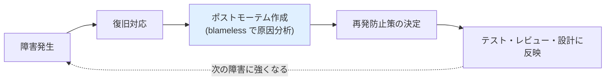

## このセクションで学ぶこと

- 蛾・Ariane 5・Mars Climate Orbiter — 三つの物語の「後日談」に共通する、人ではなく仕組みを問う姿勢
- 障害を記録して共有する**ポストモーテム**と、犯人探しをしない **blameless** という文化
- テスト・コードレビュー・単位を型で持つ設計 — 失敗が道具に姿を変えて現代に残っていること

## 「障害のご報告とお詫び」はなぜ公開されるのか

サービスが止まったあと、運営会社が「障害のご報告とお詫び」というページを公開しているのを見たことはないでしょうか。発生時刻、影響範囲、原因、再発防止策。読んでみると、自社のミスを驚くほど赤裸々に説明していることがあります。失敗は隠したくなるのが人情なのに、なぜわざわざ世界に向けて公開するのか — その答えは、この章で見てきた三つの事故の「その後」につながっています。

Ariane 5 の事故調査報告書は全文が公開され、ソフトウェア工学の古典教材になりました。Mars Climate Orbiter の調査委員会が原因として名指ししたのは、担当者個人ではなく**プロセスの欠陥**でした。さらにさかのぼれば、1947 年に蛾をログブックに貼り付けた行為そのものが、「起きたことを記録して残す」文化の原型です。**失敗を隠さず、記録し、共有して、仕組みを直す** — 三つの物語は同じ結論を指しています。

## ポストモーテムと blameless — 人ではなく仕組みを問う

障害が収束したあとに、何が起きたか・なぜ起きたか・どう防ぐかをまとめる振り返りを、エンジニアリングの世界では**ポストモーテム**(postmortem、もとは「検死」の意味)と呼びます。Google などの大規模サービス運用を通じて広まり、いまでは多くの開発組織が取り入れている習慣です。

ポストモーテムには大事な約束ごとがあります。**blameless(非難しない)**、つまり犯人探しをしないことです。これは優しさではなく合理性です。ミスをした人が罰される組織では、人は失敗を隠し、ヒヤリとした兆候を報告しなくなります。Mars Climate Orbiter では「計算と観測が合わない」と気づいた人がいたのに、その懸念は正式な手続きに乗らないまま流れました。懸念を口に出しやすい空気こそが、次の事故を防ぐ資産なのです。

そもそも、担当者を入れ替えても同じ事故が起きるなら、原因は人ではなく仕組みの側にあります。Ariane 5 では関係者の誰もが「合理的に」振る舞った結果としてロケットが落ちました。責めて済む「うっかり者」は、どこにもいなかったのです。

## 失敗は道具に姿を変える — テスト・レビュー・型

再発防止策は、文書で終わらずに**道具と習慣**へ変わっていきます。この章の事故と対応させて見てみましょう。

- **テスト**: Ariane 5 の報告書は「実際の飛行データで試験していれば発見できた」と指摘しました。現代の開発では、修正のたびに過去の不具合が再発していないかを自動で確かめる**回帰テスト**が当たり前になっています。一度踏んだ地雷を、テストという形で永久に見張り続けるわけです。
- **コードレビュー**: 書いた本人には、自分の思い込みが見えません。「この変換、値が範囲を超えたらどうなる?」という他人の目を通す習慣は、Ariane 5 を落とした「コードのどこにも書かれていない前提」を掘り起こすための仕組みです。
- **単位を型で持つ設計**: Mars Climate Orbiter 型の事故への対策はもっと直接的です。数値を「ただの数」ではなく「ニュートンという単位付きの値」としてプログラム上の**型**で区別すれば、ポンド力の値をニュートンの計算に混ぜた瞬間、飛ばす前にエラーとして検出できます。F# のように単位付きの型を言語機能として備えるプログラミング言語もあります。

注意したいのは、blameless が「責任を曖昧にすること」ではない点です。誰も責めない代わりに、組織として再発防止策を決めて実行するところまでが責任の取り方です。ポストモーテムも書いて満足したら意味がなく、対策がテストや設計に反映されて初めて完了といえます。失敗を隠す組織は同じ失敗を繰り返し、失敗を記録する組織だけが失敗を資産に変えられる — 蛾の貼られたログブックから 80 年近く、エンジニアリングはそうやって進化してきました。

## まとめ

- 三つの事故調査はいずれも「個人のミス」ではなく「仕組みの欠陥」を原因とし、報告を公開・共有する文化につながった
- ポストモーテムは障害の記録と再発防止の習慣であり、blameless(非難しない)原則が兆候の報告しやすさを守る
- 回帰テスト・コードレビュー・単位を型で持つ設計など、過去の失敗は道具と習慣に姿を変えて現代の開発に残っている
