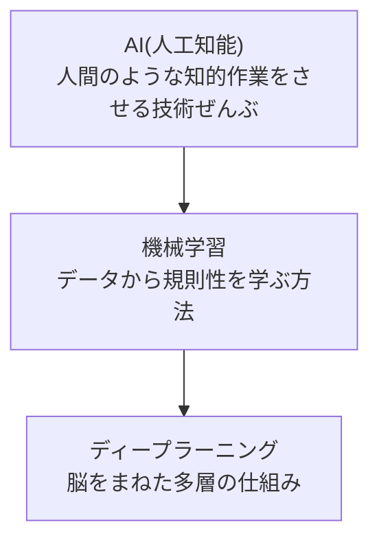

## このセクションで学ぶこと

- AI・機械学習・ディープラーニングが「入れ子」になっていること
- それぞれの言葉がどれくらいの「広さ」を指すのか
- ニュースで混同されがちな三つを、自分の言葉で区別できるようになること

## 三つの言葉は、大きさが違う

ニュースを見ていると「AI」「機械学習」「ディープラーニング」という言葉がほとんど同じ意味のように飛びかいます。けれど、この三つは本当は大きさの違う言葉で、きれいに入れ子の関係になっています。

いちばん外側にあって、いちばん広いのが **AI(人工知能)** です。「人間っぽい知的な作業をコンピュータにやらせる」という大きな目標やジャンル全体を指します。

そのAIを実現する代表的な方法が **機械学習** です。人間が一から細かいルールを書くのではなく、たくさんのデータを見せて「規則性」を自分でつかませるやり方です。

そして、その機械学習の中でも特に強力な一手法が **ディープラーニング(深層学習)** です。脳の神経のつながりをまねた仕組みを何層も重ねることで、複雑なパターンを学べるようにしたものです。

矢印は「中に含む」という意味です。AI の中に機械学習があり、その機械学習の中にディープラーニングがある。マトリョーシカ人形のような関係だと思ってください。

## 具体例 — 入れ子をたとえで

「乗り物 ⊃ 自動車 ⊃ 電気自動車」を思い浮かべると分かりやすいです。電気自動車はまちがいなく自動車ですし、自動車はまちがいなく乗り物です。でも逆に「乗り物 = 電気自動車」とは言えません。

同じように、ディープラーニングは機械学習の一種であり、機械学習は AI の一種です。けれど「AI = ディープラーニング」ではありません。AI には、データから学ばずに人間が決めたルールだけで動く昔ながらの仕組みも含まれます。たとえば「気温が28度を超えたらエアコンを入れる」といった単純なルールの集まりも、AIと呼ばれることがあります(ただし、こうした単純な制御を AI と呼ぶかどうかは議論があります)。学習はしていなくても、人間の代わりに判断しているからです。

## 注意点 — 言いかえてはいけない

この三つを同じ意味で使うと、話がかみ合わなくなります。たとえば「うちは AI を導入した」と言っても、それが手書きのルールなのか、機械学習なのか、ディープラーニングなのかで中身はまったく違います。

そのため、AI 関連のニュースを読むときは「これは三つのうちどのレベルの話だろう?」と一段ほり下げてみると、内容がぐっとつかみやすくなります。「広い言葉ほど、何を指しているかあいまいになる」と覚えておきましょう。AI はいちばん広い看板の言葉、機械学習はその中の主力の方法、ディープラーニングはさらにその中の強力な一手法。この順番だけ押さえれば、ニュースの解像度がぐっと上がります。

## まとめ

- AI ⊃ 機械学習 ⊃ ディープラーニング という入れ子の関係です。
- AI はジャンル全体、機械学習はデータから学ぶ方法、ディープラーニングはその中の多層の手法です。
- 三つは大きさが違う言葉なので、同じ意味で言いかえないようにしましょう。
