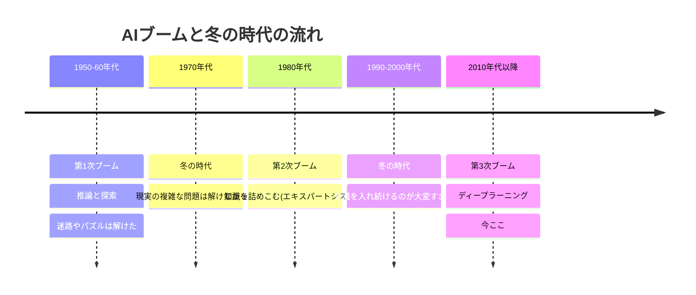

## このセクションで学ぶこと

- AI が一気に流行する「ブーム」が、これまで3度あったこと
- ブームのあとに来た「冬の時代」と、その理由の大きな流れ
- 今のブームは何がきっかけで起きたのか

## AI は一直線には進んでこなかった

AI は誕生してから今日まで、ずっと右肩上がりで発展してきた…わけではありません。実際は「すごく期待される時期」と「期待はずれでしぼむ時期」を、波のようにくり返してきました。盛り上がる時期を **AIブーム**、その後の冷えこむ時期を **冬の時代** と呼びます。

## それぞれのブームで何が起きたか

**第1次ブーム(推論と探索)** では、コンピュータに「考える筋道」をたどらせて、迷路やパズルを解かせることに成功しました。人々は「ついに考える機械ができた」と熱狂します。けれど、ルールがはっきりしたゲームは解けても、現実のあいまいで複雑な問題には歯が立たず、期待はしぼみました。これが最初の冬の時代です。

**第2次ブーム(知識の時代)** では、専門家の知識をたくさんルールとしてコンピュータに教えこむ方法が流行りました。「お腹が痛くて熱があるなら○○の可能性」といった具合に、知識を詰めこんで判断させる仕組み(エキスパートシステム)です。しかし、世の中の知識を人間が手で入れ続けるのは果てしなく、例外も多すぎて行きづまりました。ふたたび冬の時代です。

**第3次ブーム(今)** の引き金になったのが **ディープラーニング** です。人間がルールを書くのではなく、大量のデータからコンピュータ自身が規則性を学ぶ。しかも、扱えるデータの量とコンピュータの計算力が一気に増えたことで、これがうまく回り始めました。画像認識や言葉の扱いで人間に迫る性能が出て、今の大きなブームにつながっています。

## 注意点 — 「今度こそ本物」かは歴史が教える

ここで気をつけたいのは、過去2回のブームも当時は「今度こそ本物だ」と信じられていたことです。当時の人々も真剣に未来を期待していました。だからこそ、今のブームを冷静に見る目も大事になります。流行り言葉に流されず、何が実際にできて何がまだできないのかを見分ける姿勢が役に立ちます。

とはいえ、今回のブームは過去とは規模が違うのも事実です。すでに私たちの日常に AI がとけ込んでいる(セクション 01-01)こと自体が、その証拠と言えるでしょう。研究室の中だけの話だった過去のブームと違い、今回は一般の人が毎日使うサービスにまで届いている。ここが大きな違いです。歴史を知っておくと、新しいニュースが出たときに「これは本質的な進歩か、それとも過度な期待か」を落ちついて考えられます。冬の時代があったからこそ今がある、という流れごと頭に入れておくとよいでしょう。

## まとめ

- AI は3度のブームと、その間の冬の時代をくり返してきました。
- 第1次は推論と探索、第2次は知識の詰めこみ、第3次はディープラーニングが主役です。
- 過去も「今度こそ」と言われたことを思い出し、今のブームも冷静に見ましょう。
