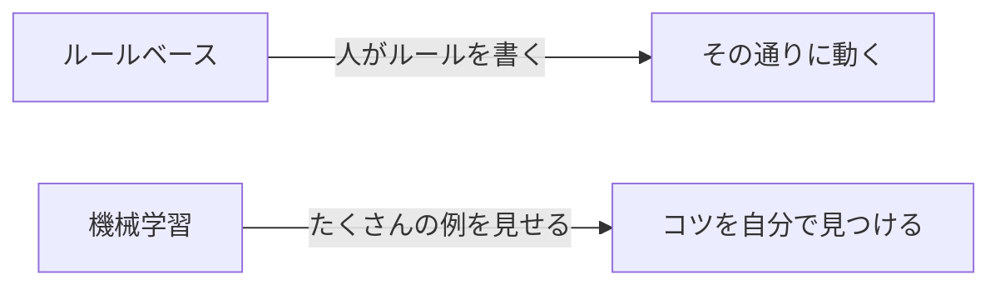

## このセクションで学ぶこと

- 昔のコンピュータは人が決めたルールどおりに動いていたことを理解する
- 機械学習は「答えの例」をたくさん見せて自分でコツをつかませる発想だと知る
- ルールを書ききれない問題こそ機械学習の出番だとイメージできる

## 「こうしなさい」と全部教えていた時代

ひと昔前のコンピュータは、人間が「こういうときは、こうしなさい」という手順をすべて書いて動かしていました。これを **ルールベース** のやり方と呼びます。電卓やレジ、自動販売機を思い浮かべてください。投入された金額がボタンの値段以上なら商品を出す、というルールを人が決めて、その通りに動いています。とても正確で、間違えません。

ルールがはっきりしている問題なら、これで十分です。むしろ機械学習よりも確実で速いこともあります。

## ルールを書ききれない問題が出てきた

ところが、世の中には「ルールを言葉で書ききれない問題」がたくさんあります。たとえば「この写真に写っているのは犬ですか、猫ですか」という問いです。

「耳が三角なら猫」と書いても、三角の耳の犬もいます。「ヒゲがあれば猫」と書いても、写真の角度によってはヒゲが見えません。人間は一瞬で見分けられるのに、その判断を細かいルールの言葉に分解しようとすると、例外だらけで手に負えなくなります。

## 例から「コツ」をつかませる

そこで発想を変えます。ルールを人が書く代わりに、**犬の写真と猫の写真を何千枚も見せて、コンピュータ自身に見分けるコツを見つけさせる** のです。これが **機械学習** です。

料理の見習いに似ています。レシピの分量を一行ずつ暗記させるのではなく、先輩の手元を何百回も見せて「なんとなくこの感じ」を体で覚えさせるイメージです。見せる例が多いほど、コツの精度は上がっていきます。

大事なのは、機械学習がルールベースの上位互換ではないという点です。きっちりルールが書ける問題はルールベースの方が向いています。**ルールを書ききれない、あいまいで例外の多い問題でこそ** 機械学習が力を発揮します。

## まとめ

- 昔のコンピュータは人が書いたルール通りに動く「ルールベース」だった
- 機械学習はたくさんの例を見せて、コツを自分で見つけさせる発想
- ルールを言葉で書ききれないあいまいな問題こそ機械学習の出番
