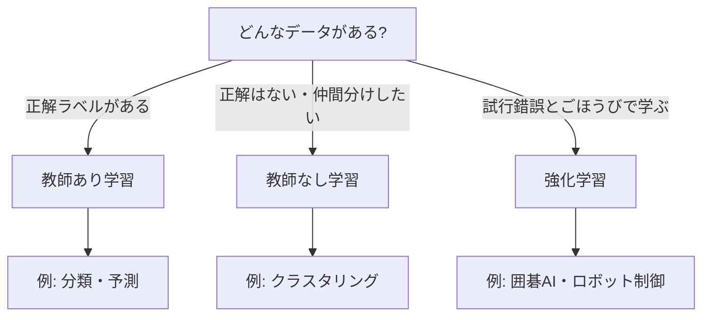

## このセクションで学ぶこと

- 教師あり学習は「問題と正解のセット」で学ぶことを理解する
- 教師なし学習は「正解なし」でデータの仲間分けをすることを知る
- 強化学習は「試して、ごほうびで賢くなる」やり方だとイメージできる

## 学び方は大きく3つに分かれる

機械学習にもいくつかの学び方があります。代表的なのが **教師あり学習・教師なし学習・強化学習** の3つです。名前は難しそうですが、人間の学び方にたとえると一気にわかりやすくなります。

## 教師あり学習 — 正解つきの問題集で学ぶ

**教師あり学習** は、問題と正解がセットになったデータで学ぶやり方です。「この写真は犬」「この写真は猫」というように、一枚ごとに正解(ラベルと呼びます)が付いています。

ちょうど、答え付きの問題集をひたすら解く受験勉強に似ています。たくさん解くうちに、新しい問題でも正解を当てられるようになります。迷惑メールの判定、売上の予測、画像の分類など、世の中の機械学習の多くはこのタイプです。

## 教師なし学習 — 正解なしで仲間分け

**教師なし学習** は、正解を与えません。データだけを渡して「似たもの同士をまとめて」とお願いするイメージです。

たとえばお店のお客さんのデータを渡すと、「よく夜に来る人たち」「週末にまとめ買いする人たち」といったグループに自動で分けてくれます。このグループ分けを **クラスタリング** と呼びます。あらかじめ正解のグループが決まっているわけではなく、データの中の隠れた傾向を見つけ出すのが得意です。

## 強化学習 — 試して、ごほうびで覚える

**強化学習** は、いろいろ試してみて、うまくいったらごほうびをもらう、という学び方です。犬のしつけを思い浮かべてください。「おすわり」ができたらおやつをあげる。これを繰り返すと、犬はごほうびがもらえる行動を覚えていきます。

囲碁や将棋で人間に勝った AI、ゲームを自分でうまくなる AI、ロボットの動きの習得などがこのタイプです。最初はめちゃくちゃに動きますが、ごほうび(得点)を頼りに少しずつ賢くなります。

## どれを使うかは「正解が用意できるか」で決まる

3つのうちどれを選ぶかは、多くの場合「正解(ラベル)を用意できるか」で決まります。たとえば過去の迷惑メールに「これは迷惑」「これは普通」という印が付いているなら、教師あり学習が使えます。印を付ける作業は人手がかかるので、ここがそろえられるかどうかが現場では大きな分かれ目になります。

正解を一つひとつ用意するのが難しいときは、教師なし学習で「とりあえず似たもの同士に分けてみる」ところから始めます。そして、ゴールが「最終的にどうなれば成功か」というごほうびの形で表せるとき、たとえばゲームのスコアやロボットが転ばずに歩いた距離などがはっきりしているときは、強化学習が向いています。

## 注意したいこと

この3つはきれいに分かれているように見えますが、実際には組み合わせて使うこともよくあります。「まず教師なしでざっくり分けてから、教師ありで仕上げる」といった具合です。また、強化学習は派手な成功例が有名なぶん万能に見えがちですが、学習に膨大な試行回数がかかるなど扱いが難しい面もあります。まずは「正解つきで学ぶか・正解なしで分けるか・試して覚えるか」という大きな違いをつかめれば十分です。

## まとめ

- 教師あり学習は、問題と正解のセットで学ぶ(分類や予測が得意)
- 教師なし学習は、正解なしで似たもの同士をまとめる(クラスタリング)
- 強化学習は、試して、ごほうびで賢い行動を覚える
