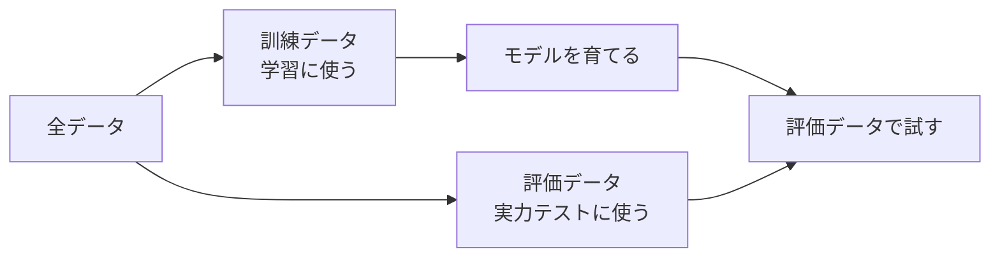

## このセクションで学ぶこと

- データを訓練用と評価用に分ける理由を理解する
- 過学習は「丸暗記して応用がきかない状態」だとイメージできる
- 汎化は「初めて見る問題にも対応できる力」だと知る

## 「賢くなった」は、どうやって確かめる?

機械学習でモデルを育てたあと、「本当に賢くなったのか」を確かめたくなります。ここで気をつけたいのは、**練習で使った問題でテストしても意味がない** ということです。

受験勉強を思い出してください。問題集を何周もして答えを覚えてしまえば、その問題集では満点が取れます。でもそれは「賢くなった」のではなく「答えを暗記しただけ」かもしれません。本当の実力は、初めて見る模試で測りますよね。

## データを2つに分けておく

そこで機械学習では、手元のデータを2つに分けます。学習に使う **訓練データ** と、学習には一切使わずに取っておく **評価データ** です。訓練データで学ばせ、評価データで「初めて見る問題」として試します。これで、丸暗記ではない本当の実力を測れます。

## 過学習 — 丸暗記しすぎた状態

訓練データに合わせすぎて、初めて見るデータにうまく対応できなくなることを **過学習** と呼びます。まさに「問題集を丸暗記したけれど模試では点が取れない」状態です。

過学習したモデルは、訓練データでは抜群の成績を出すのに、評価データになると急に成績が落ちます。これが見分けるサインです。たとえば、訓練データでは99点なのに評価データでは60点しか取れない、というような大きな差が出たら、過学習を疑います。

なぜこんなことが起きるのでしょうか。原因の一つは、データの本質的な傾向だけでなく、たまたまそのデータに紛れ込んだ細かいクセやノイズまで覚えてしまうことです。「この問題集のこのページの3問目はウ」というような、本番では役に立たない暗記をしてしまうイメージです。

## 汎化 — 本当にほしい力

反対に、学んだことを初めて見るデータにもうまく当てはめられる力を **汎化** と呼びます。機械学習で本当にほしいのは、この汎化の力です。訓練データだけで満点を取ることではなく、まだ見ぬデータに対応できることがゴールなのです。実際の仕事でも、すでに答えがわかっている過去のデータをうまく当てるより、これから来る未知のお客さんやデータに対応できることのほうが価値があります。

注意点として、たくさん学習させればさせるほど良い、とは限りません。学習しすぎると過学習に傾くこともあります。「ほどよく学んで、応用がきく」状態を目指すのがコツです。

逆に、学習が足りずに訓練データすら十分に当てられない状態もあります。これは「未学習(学習不足)」と呼ばれ、過学習とは反対の問題です。学びが足りなければ実力は付かず、学びすぎれば丸暗記に偏る。その間の「ちょうどよいところ」を探すのが、機械学習を扱ううえでの腕の見せどころです。完璧な正解はなく、訓練データと評価データの成績を見比べながら少しずつ調整していきます。

## まとめ

- データは訓練用と評価用に分け、初めて見る問題で実力を測る
- 過学習は、訓練データを丸暗記して応用がきかない状態
- 本当にほしいのは、初めて見るデータにも対応できる「汎化」の力
