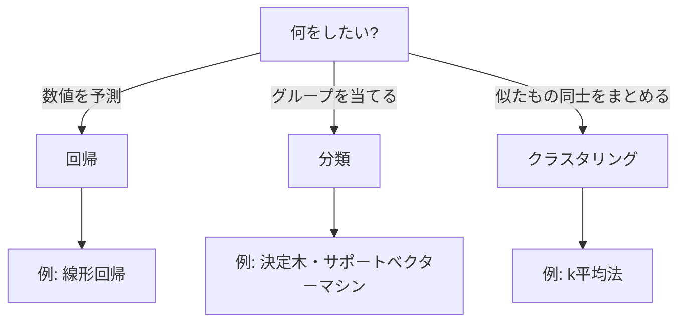

## このセクションで学ぶこと

- 機械学習には目的別にいろいろなアルゴリズムがあることを知る
- 回帰・分類・クラスタリングという代表的な目的を区別できる
- 名前を全部覚える必要はなく「地図」として眺めればよいと理解する

## アルゴリズムは「学び方のレシピ」

機械学習には、たくさんの **アルゴリズム** があります。アルゴリズムとは、問題を解くための手順やレシピのことです。同じ「コツをつかむ」という目的でも、料理にいろいろな調理法があるように、学び方のレシピも何種類もあります。

ここで全部の名前を覚える必要はありません。**こういう目的にはこういう道具がある、という地図** を頭に持っておくだけで十分です。

## まずは「何をしたいか」で分ける

アルゴリズムを選ぶとき、最初に見るのは「何をしたいか」です。代表的なのは次の3つです。

- **回帰**: 数値を予測したい。明日の気温、来月の売上、家賃など。
- **分類**: どのグループかを当てたい。犬か猫か、迷惑メールかどうかなど。
- **クラスタリング**: 正解なしで似たもの同士をまとめたい(教師なし学習でしたね)。

## 名前だけ顔見知りになっておく

具体的な名前をいくつか挙げておきます。**決定木** は「はい・いいえ」の質問を枝分かれでたどっていく、人間にもわかりやすいアルゴリズムです。健康診断の問診票のように、質問を順にたどると答えにたどり着くイメージで、なぜその結論になったのかを人が追いやすいのが長所です。たくさんの決定木を組み合わせて精度を上げる方法(ランダムフォレストなどと呼ばれます)もあります。

ほかにも、数値を予測する線形回帰、グループの境目をきれいに引くサポートベクターマシン、似たもの同士をまとめるk平均法など、目的に応じた道具がそろっています。名前だけ「顔見知り」になっておけば十分です。

ここでのねらいは、こうした言葉に出会ったときに「あ、これは機械学習のアルゴリズムの一つだな」と落ち着いて受け止められることです。中身の計算を理解する必要はまだありません。地図の上で位置がわかっていれば、必要になったときに詳しく調べられます。

## 注意したいこと

「一番すごいアルゴリズムはどれ?」という問いには、実は答えがありません。データの種類や目的によって向き不向きが変わるからです。データが少ないときに向く道具、人に説明しやすさが求められる場面で向く道具、とにかく精度を追いたいときに向く道具と、それぞれに得意分野があります。万能の一つを探すより、目的に合った道具を選ぶ、という感覚が大切です。

なお、次の章で出てくるディープラーニングも、機械学習のアルゴリズムの一種です。地図全体の中の、とくに大きく育った一区画だと思っておくと、章のつながりが見えてきます。

## まとめ

- アルゴリズムは「学び方のレシピ」で、目的別にたくさんある
- まずは回帰・分類・クラスタリングという目的の違いで眺める
- 名前を全部覚えるより、地図として「こういう道具がある」と知っておけば十分
