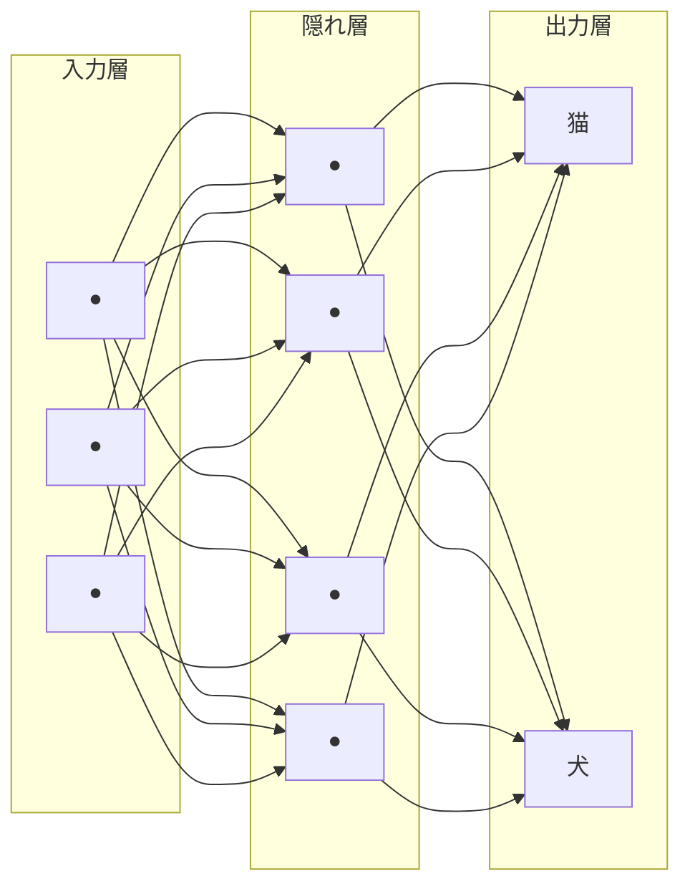

## このセクションで学ぶこと

- ニューラルネットワークが人間の脳の神経細胞をヒントに生まれたこと
- 入力層・隠れ層・出力層という「層」が重なってできていること
- 「ディープ」とは隠れ層がたくさん重なっている状態を指すこと

## 脳の神経細胞をまねた、というアイデア

前の章では「機械学習はデータから学ぶ」という考え方を見てきました。その機械学習の中でも、いま一番元気なのが**ディープラーニング(深層学習)**です。その正体を知るために、まずは土台となる**ニューラルネットワーク**から見ていきましょう。

ニューラルネットワークは、もともと**人間の脳のしくみをヒント**に生まれました。私たちの脳の中には、神経細胞(ニューロン)がたくさんあって、互いに信号を受け渡しながらものを考えています。「この信号は強く伝える」「これは弱めに伝える」といった調整を無数にくり返すことで、私たちは顔を見分けたり言葉を理解したりしています。

この「たくさんの小さな部品が信号を受け渡して答えを出す」という発想をコンピュータでまねたものが、ニューラルネットワークです。あくまで「ヒントにした」だけで、本物の脳をそっくり再現しているわけではありません。ここはよく誤解されるので、軽く頭の片隅に置いておいてください。

## 「層」が重なってできている

ニューラルネットワークは、小さな計算をする部品(ノード)が**層(レイヤー)**になって並び、その層が何枚も重なってできています。大きく分けると次の3種類です。

- **入力層**: 写真の明るさや文章の単語など、最初のデータを受け取る入り口。
- **隠れ層**: 入力と出力のあいだで情報を少しずつ加工していく中間の層。
- **出力層**: 「これは猫です」「確率は90%です」といった最終的な答えを出す出口。

入り口から入った情報が、隠れ層を通るうちに少しずつ「猫っぽさ」「犬っぽさ」へと加工され、最後に出口で答えになる——そんなイメージです。流れ作業のラインで、原料が工程を通るたびに製品らしくなっていくのに少し似ています。

## 「ディープ」とは層が深いこと

では「ディープ(深い)」とは何でしょうか。これは難しい話ではなく、**隠れ層がたくさん重なっている**状態を指します。隠れ層が1〜2枚しかないものを「浅い」、何枚も何十枚も重なっているものを「深い=ディープ」と呼びます。

層が深くなるほど、データの中の細かい特徴や複雑なパターンをとらえられるようになります。ただし、ただ層を増やせば賢くなるわけではなく、学習させるためのデータや計算の工夫も必要です。その「なぜ急に強くなったのか」は次のセクションで見ていきます。

## まとめ

- ニューラルネットワークは脳の神経細胞をヒントにした、小さな計算のつながりです。
- 入力層・隠れ層・出力層という層が重なり、情報が加工されて答えになります。
- 隠れ層が深く重なった状態を「ディープ」と呼びます。
