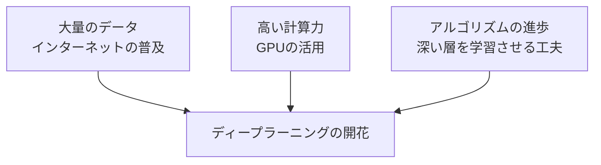

## このセクションで学ぶこと

- ディープラーニングの最大の強みは「特徴量を自動で見つける」こと
- 大量のデータ・高い計算力・アルゴリズムの進歩が同時にそろったこと
- 昔は人が手作業で特徴を教えていたという対比

## 昔は「手がかり」を人が教えていた

ニューラルネットワークのアイデア自体は、実はずいぶん昔からありました。それなのに、なぜ2010年代になって急に注目を集めたのでしょうか。鍵になるのが**特徴量**という言葉です。

特徴量とは、データの中で「答えを見分けるための手がかり」のことです。たとえば写真から猫を見分けたいとき、「とがった耳」「ひげ」「丸い目」などが手がかりになりますね。これが特徴量です。

昔の機械学習では、この手がかりを**人間が手作業で決めて**コンピュータに教えていました。「耳の角度を測りなさい」「ひげの本数を数えなさい」といった具合です。これはとても手間がかかるうえ、人が思いつかない手がかりは見逃してしまいます。料理にたとえるなら、すべての下ごしらえを人が指示してあげないと、コンピュータは何も作れなかったのです。

## ディープラーニングは手がかりを自分で見つける

ディープラーニングのすごいところは、この**特徴量を自分で見つけてしまう**点です。大量の猫の写真を見せるだけで、「どこに注目すれば猫だと分かるか」をネットワークが自動的に学び取ります。人が「耳を見なさい」と教えなくてよいのです。

これを**特徴量の自動抽出**と呼びます。下ごしらえまでコンピュータが勝手にやってくれるようになった、というイメージです。この性質のおかげで、画像・音声・言葉のように手がかりを言葉で説明しづらいデータでも、高い精度を出せるようになりました。「猫らしさとは何か」を私たちが言葉にできなくても、たくさんの例さえ見せればネットワークが勝手につかんでくれるのです。これは人にとっても大きな負担の軽減でした。

## 三つの追い風が同時にそろった

とはいえ、強みがあっても道具がそろわなければ実現しません。ディープラーニングが一気に開花したのは、次の三つがほぼ同じ時期にそろったからです。

- **大量のデータ**: インターネットやスマホの普及で、写真や文章が世界中に大量に蓄積されました。学ぶ材料が増えたのです。
- **高い計算力**: もともとゲームの画像処理用だった**GPU**が、ディープラーニングの大量計算にうってつけだと分かり、学習が現実的な時間で終わるようになりました。
- **アルゴリズムの進歩**: 深い層をうまく学習させるための工夫が次々と見つかりました。

「賢いアイデア」「学ぶ材料」「計算する力」がそろって初めて、ディープラーニングは実力を発揮できたのです。

## まとめ

- ディープラーニング最大の強みは、手がかり(特徴量)を自分で見つけることです。
- 昔は人が手作業で手がかりを教えていたため、手間が大きく見逃しもありました。
- 大量のデータ・GPUの計算力・アルゴリズムの進歩がそろって一気に開花しました。
