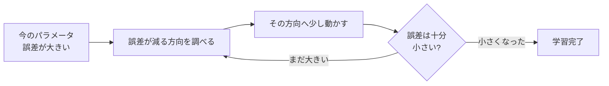

## このセクションで学ぶこと

- 学習とは「答えのズレ(誤差)を小さくする」作業だということ
- パラメータを少しずつ調整して誤差を減らす流れ(勾配降下法)のイメージ
- 学習しすぎると過学習につながるという前章とのつながり

## 学習とは「ズレを小さくする」こと

ニューラルネットワークが「学ぶ」とは、具体的には何をしているのでしょうか。難しい数式は使わず、雰囲気だけつかみましょう。

ネットワークの中には、「どの信号をどれくらい強く伝えるか」を決める**パラメータ**という数値がたくさんあります。前のセクションで出てきた、信号を強めたり弱めたりする調整つまみのようなものです。最初、このつまみはでたらめに設定されているので、答えもめちゃくちゃです。猫の写真を見せても「犬!」と自信満々に間違えたりします。

このとき、AIの答えと本当の正解とのズレを**誤差**と呼びます。学習とは、要するに**この誤差をできるだけ小さくするように、つまみ(パラメータ)を調整していく作業**なのです。

## 谷を下りるように、少しずつ調整する

誤差を小さくする方法が**勾配降下法**です。名前は難しそうですが、イメージは「**谷を下りる**」だけです。

霧の濃い山の中で、目隠しをしたまま一番低い谷底を目指す場面を想像してください。一気にどこへ行けばいいかは分かりません。でも、足元の傾きをさわって「こっちが下り坂だ」と分かれば、その方向に一歩進めます。これを何度もくり返せば、少しずつ谷底へ近づいていけますね。

勾配降下法もこれと同じで、「誤差が小さくなる方向はどっちか」を調べ、その方向にパラメータをほんの少し動かす——これをひたすらくり返します。一歩の大きさを**学習率**と呼んだりしますが、いまは「少しずつ進む」とだけ覚えておけば十分です。一歩が大きすぎると谷底を通り過ぎてしまい、小さすぎると時間がかかりすぎる、という具合に、ちょうどよい歩幅にも工夫が要ります。こうして誤差が十分に小さくなったら、学習はひとまず完了です。ディープラーニングの学習とは、結局このくり返しを膨大な回数こなしているのだ、とイメージしておきましょう。

## 注意:下げすぎても困る

ここで前の章を思い出してください。訓練データに対する誤差をひたすら下げれば下げるほどよい、というわけではありません。訓練データだけに合わせすぎると、新しいデータに弱くなる**過学習**が起きてしまいます。

谷を下りるたとえでいえば、「この山の、この谷底」にこだわりすぎて、ほかの山では役に立たない状態です。実際の学習では、誤差を下げつつも過学習に陥らないようバランスを取ります。学習とは、ただズレを潰す作業ではなく「ほどよく学ぶ」ことなのだと押さえておきましょう。

## まとめ

- 学習とは、答えのズレ(誤差)が小さくなるようにパラメータを調整することです。
- 勾配降下法は、誤差が減る方向へ少しずつ進む「谷下り」のイメージです。
- 下げすぎると過学習になるため、ほどよく学ぶバランスが大切です。
