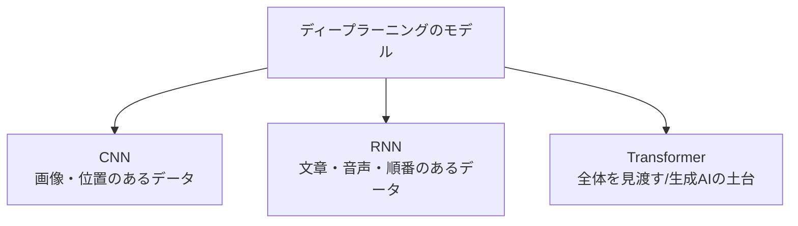

## このセクションで学ぶこと

- CNN は画像など「位置のあるデータ」を見るのが得意なこと
- RNN は文章や音声など「順番のあるデータ」を扱うのが得意なこと
- Transformer が全体を見渡す仕組みで、いまの生成AIの土台であること

## 同じディープラーニングでも形はいろいろ

ここまで「ニューラルネットワーク」とひとくくりに話してきましたが、実際には**扱うデータの種類に合わせて姿を変えた**モデルがいくつもあります。料理人が、刺身には刺身包丁、パンにはパン切りナイフを使い分けるのと同じです。代表的な三つを、名前と「何が得意か」だけ押さえましょう。細かい中身は覚えなくて大丈夫です。

## CNN — 画像を見るのが得意

**CNN(畳み込みニューラルネットワーク)**は、**画像のように「位置」が意味を持つデータ**を扱うのが得意です。

写真を理解するとき、いきなり全体を丸ごと見るのではなく、小さな枠(虫めがね)を少しずつずらしながら「ここに線がある」「ここに角がある」と部分の特徴を拾っていきます。それを積み重ねて「これは猫の顔だ」と判断します。画像認識や顔認証、医療画像の診断支援など、目に見えるものを扱う場面で広く使われています。

## RNN — 順番のあるデータが得意

**RNN(リカレントニューラルネットワーク)**は、**文章や音声のように「順番」が意味を持つデータ**を扱うのが得意です。

「私はパンを食べた」という文は、単語の順番が変わると意味が変わってしまいますね。RNN は前に出てきた言葉を覚えながら次の言葉を処理することで、流れや文脈をとらえます。前の単語を記憶しつつ読み進める、というイメージです。かつては翻訳や音声認識で活躍しました。

## Transformer — 全体を見渡し、生成AIの土台に

そして近年の主役が **Transformer(トランスフォーマー)**です。RNN のように一語ずつ順番に処理するのではなく、**文章全体を一度に見渡して「どの言葉とどの言葉が関係しているか」**をとらえます。

「それを取って」の「それ」が文中のどれを指すのか、離れた言葉どうしの関係も一気に把握できるのが強みです。一語ずつ順番に読む RNN と違って全体をまとめて処理できるため、学習も速く、長い文章にも強いという利点があります。この仕組みは、いまをときめく**大規模言語モデル(LLM)や生成AI**の土台になっています。ChatGPT のようなサービスも、この Transformer の流れの上に立っています。次の章で詳しく触れる「言葉をあつかうAI」の主役だと覚えておくとよいでしょう。

三つの名前と得意分野が「なんとなく」つながれば、このセクションは十分です。次の章では、これらの仕組みを使って AI が実際に何をできるようになったのかを見ていきます。

## まとめ

- CNN は画像など位置が意味を持つデータを見るのが得意です。
- RNN は文章や音声など順番が意味を持つデータを扱うのが得意です。
- Transformer は全体を見渡す仕組みで、いまの生成AIの土台になっています。
