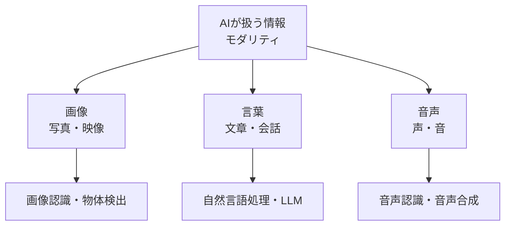

## このセクションで学ぶこと

- 画像認識が「画像に何が写っているか」を当てる技術だということ
- 画像認識・物体検出・顔認証など、身近なところでの使われ方
- AIが扱う情報の種類(モダリティ)の全体像

## 写真を見て「これは何か」を当てる

画像認識とは、ひとことで言えば **「写真を見て、そこに何が写っているかをAIが当てる」** 技術です。私たちは猫の写真を見れば一瞬で「猫だ」とわかりますが、コンピュータにとっては長らくとても難しい作業でした。

転機になったのが、第3章で出てきたディープラーニングです。大量の写真を見せて学習させることで、AIは「猫らしさ」「犬らしさ」といった特徴を自分でつかめるようになりました。今では写真を渡すと「これは猫です」と高い精度で答えてくれます。

## どんなところで使われているか

画像認識は、すでに私たちの生活のあちこちに入りこんでいます。

- **スマホの顔認証**: カメラに映った顔が「持ち主かどうか」を見分けています。
- **写真アプリの自動整理**: 「海」「料理」「人物」などで写真を勝手に分類してくれます。
- **自動運転**: 前方の歩行者・信号・他の車を見つけ出します。
- **医療**: レントゲンやCT画像から、病気の疑いがある部分を見つける手助けをします。

特に「画像のどこに何があるか」を **枠つき** で見つける技術を **物体検出** と呼びます。自動運転で「右前方に歩行者」と位置まで知る必要がある場面で活躍する、一歩進んだ使い方です。

## AIが扱う「情報の種類」を見渡す

ここで少し視野を広げましょう。AIが相手にする情報には、画像のほかにも **言葉**(文章)や **音声** などがあります。こうした情報の種類を **モダリティ** と呼びます。この章ではモダリティごとに「AIに何ができるようになったか」を見ていきます。

画像は本セクション、言葉は次のセクション、音声はその次で扱います。それぞれ得意な技術は違いますが、土台にディープラーニングがある点は共通しています。

## 注意点

画像認識は万能ではありません。学習に使った写真にかたよりがあると、見慣れない角度や暗い場所ではうまく当てられないことがあります。「だいたい当たるが、絶対ではない」という前提で使うことが大切です。

## まとめ

- 画像認識は「写真に何が写っているか」をAIが当てる技術。
- 位置まで見つける物体検出は、自動運転などで活躍する。
- AIが扱う情報の種類を「モダリティ」と呼び、画像・言葉・音声などがある。
