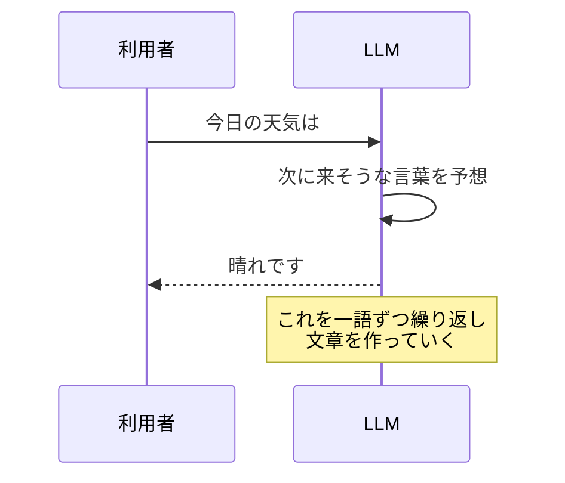

## このセクションで学ぶこと

- 自然言語処理が「人間の言葉をAIが扱う」分野だということ
- 大規模言語モデル(LLM)が「次に来る言葉」を予想して文章を作っていること
- LLMが得意なこと・苦手なこと

## 「言葉」を相手にするAI

私たちが毎日使っている日本語や英語のような言葉を、専門用語で **自然言語** と呼びます。この自然言語をAIが扱う分野が **自然言語処理**(NLP)です。

翻訳、文章の要約、迷惑メールの振り分けなど、言葉を相手にする技術はずっと研究されてきました。ただ、言葉はあいまいで文脈によって意味が変わるため、長らく手ごわい相手でした。

## 大規模言語モデル(LLM)の登場

近年この分野を一変させたのが **大規模言語モデル**(LLM)です。GPT系やClaudeといったAIの名前を聞いたことがあるかもしれません。これらはみなLLMの仲間です。

LLMがやっていることは、意外なほどシンプルに説明できます。 **「ここまでの文章の続きとして、次に来そうな言葉を予想する」** ことです。

たとえば「今日の天気は」という入力に対して、もっとも自然に続きそうな言葉を選びます。これを一語ずつ繰り返すと、まとまった文章ができあがります。膨大な量の文章を学習しているため、この「次の言葉あて」がとても上手なのです。

単純な仕組みなのに、質問に答えたり文章を要約したりと、まるで言葉の意味を理解しているかのように振る舞います。この点が、多くの人を驚かせました。

## 得意なこと・苦手なこと

LLMは、文章を作る・直す・まとめるといった作業がとても得意です。一方で苦手なこともはっきりしています。

代表的なのが **ハルシネーション** と呼ばれる現象です。AIが事実と違う内容を、いかにも本当のように答えてしまうことを指します。LLMは「正しいかどうか」を確かめているのではなく、あくまで「自然に続きそうな言葉」を選んでいるだけだからです。

そのため、人名や日付などの事実確認が必要な場面では、AIの答えをそのまま信じず、必ず自分で裏を取る姿勢が欠かせません。

## 注意点

LLMは「物知りな相棒」ではありますが、「いつも正しい辞書」ではありません。下書きやアイデア出しには頼もしい一方、最終的な事実確認は人間の仕事だと覚えておきましょう。

## まとめ

- 自然言語処理は、人間の言葉をAIが扱う分野。
- LLMは「次に来そうな言葉」を予想して、自然な文章を作っている。
- 文章作成は得意だが、事実と違う内容を答えるハルシネーションに注意。
