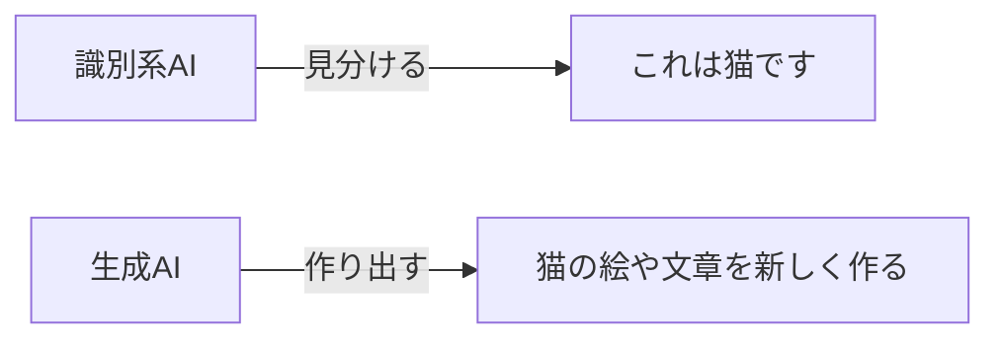

## このセクションで学ぶこと

- これまでのAIが「見分ける」のに対し、生成AIは「作り出す」こと
- 文章・画像・音声など、さまざまなものを生成AIが作れること
- 生成AIによって、誰もがAIを使える時代になったこと

## 「見分ける」から「作り出す」へ

この章でこれまで見てきたAIの多くは、 **「これは何か」を見分ける** ことを得意としてきました。写真を見て「猫だ」と当てる画像認識が代表例です。こうしたタイプを **識別系AI** と呼びます。

これに対して **生成AI**(ジェネレーティブAI)は、 **新しいものを作り出す** ことを得意とします。「猫を見分ける」のではなく「猫の絵を描く」。向いている方向がちょうど逆だとイメージするとわかりやすいでしょう。

前のセクションで出てきたLLMも、文章を「作り出す」という意味で生成AIの一種です。

## 何を作れるのか

生成AIが作り出せるものは、年々広がっています。

- **文章**: 質問への回答、メールの下書き、物語やアイデア出し。
- **画像**: 言葉で説明するだけで、その通りのイラストや写真風の画像を作る。
- **音声・音楽**: ナレーションや楽曲を生成する。
- **プログラム**: 簡単な指示からコードの下書きを作る。

これらに共通するのは、 **プロンプト** と呼ばれる指示文を与えるだけで使える点です。「青空の下で本を読む猫の絵を描いて」と書けば、それらしい画像が返ってきます。専門知識がなくても、言葉で頼むだけでよいのです。

## なぜ「衝撃」だったのか

生成AIが大きな話題になった理由は、 **誰もが直接AIを使えるようになった** ことにあります。

それまでのAIは、多くの場合アプリやサービスの裏側で静かに動いていて、利用者が触れている実感はあまりありませんでした。ところが生成AIは、チャット画面に言葉を入力するだけで誰でもその力を引き出せます。専門家だけのものだったAIが、一気に身近な道具になったのです。

## 注意点

便利な反面、生成AIにも限界や注意点があります。前のセクションで触れたハルシネーション(事実と違う内容を答える現象)はここでも起こります。また、本物そっくりの偽画像や偽情報を作れてしまうことから、使い方のルールやモラルも問われるようになっています。

## まとめ

- これまでのAIは「見分ける」、生成AIは「作り出す」ことが得意。
- 文章・画像・音声・プログラムまで、プロンプトひとつで作れる。
- 誰もが直接AIを使える時代になったことが、生成AIの大きな衝撃だった。
