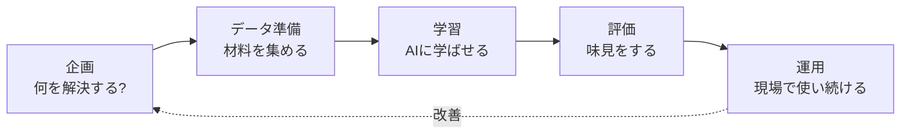

## このセクションで学ぶこと

- AIを使った仕事が「企画→データ→学習→評価→運用」という流れで進むことをイメージできる
- AIづくりは一度で終わらず、ぐるぐる回りながら良くしていく営みだと理解する
- 「何のために使うのか」を最初に決めることがいちばん大事だと気づく

## AIづくりは「料理」に似ている

ニュースで「AIを導入した」と聞くと、すごい機械をポンと置けば動き出すような印象を持つかもしれません。でも実際は、もっと地道な手順の積み重ねです。イメージは料理に近いと考えてみてください。

まず「メニューを決める」、次に「材料を買って下ごしらえする」、それから「調理する」、できたら「味見する」、最後に「お店で出し続ける」。AIづくりもこれとよく似た段階を踏みます。

## 5つの段階をざっくり見る

**企画**は「何のためにAIを使うのか」を決める段階です。「問い合わせ対応を楽にしたい」「不良品を見つけたい」といった目的をはっきりさせます。ここが曖昧なまま進むと、せっかく作ったAIが誰の役にも立たない、ということが起こります。だからこの段階がいちばん大事だと言われます。

**データ準備**は、AIに学ばせる材料(データ)を集めて整える段階です。次のセクションでくわしく扱いますが、実は全体のなかでもっとも手間がかかる地味で重要な工程です。

**学習**は、集めたデータを使ってAIに学ばせる段階です。第2章で見た「データから学ぶ」がここで起こります。

**評価**は、できあがったAIがちゃんと使えるかを確かめる段階です。第2章で出てきた、わざと取っておいたテスト用のデータで「どれくらい当たるか」を調べます。

**運用**は、合格したAIを実際の現場に置いて使い続ける段階です。

## 一度作って終わり、ではない

ここで大事なのが、図の点線です。運用してみると「思ったより当たらない」「世の中が変わってデータが古くなった」「現場の人がうまく使えない」といったことが必ず起こります。そのたびに企画やデータに戻ってAIを作り直します。つまりAIづくりは一直線ではなく、**ぐるぐる回りながら少しずつ良くしていく**ものなのです。料理のお店でも、お客さんの反応を見てメニューや味を少しずつ調整していきますよね。それと同じです。

なお、いきなり本格的に作り始めるのではなく、まず小さく試して「これで本当にうまくいきそうか」を確かめる段階を踏むことがよくあります。これを **PoC(概念実証)** と呼びます。たとえば「全部の商品をAIでチェックする」前に、まず一部の商品だけで試してみる、といった具合です。お試しでうまくいきそうだと分かってから本格的に作る方が、大きな失敗を避けられます。いきなり大きく作らず、小さく始めるのが現場の知恵です。

## 「作る人」だけでは進まない

もうひとつ知っておきたいのは、AIプロジェクトは技術者だけで進むものではない、ということです。「企画」では現場をよく知る人の声が要りますし、「データ準備」では実際の業務データを持っている人の協力が欠かせません。「運用」では現場で使う人がAIを受け入れてくれるかどうかが成否を分けます。つまりAIづくりは、技術と現場の人たちが一緒になって進める **チームの仕事** なのです。

## まとめ

- AIプロジェクトは「企画→データ準備→学習→評価→運用」という流れで進む。
- 最初の「何のために使うか」を決める企画がいちばん大事。
- 一度で完成ではなく、運用しながらぐるぐる回して良くしていく。
