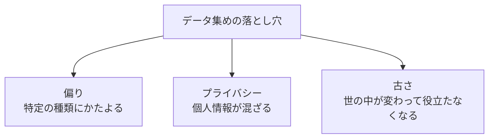

## このセクションで学ぶこと

- AIにとってデータが「燃料」のように欠かせないものだと理解する
- データは量だけでなく質(きれいさ・偏りのなさ)も大切だと気づく
- データ集めにはプライバシーや偏りといった落とし穴があることを知る

## AIはデータを食べて賢くなる

第2章で「AIはデータから学ぶ」という話をしました。ということは、データがなければAIは何も学べません。車にガソリンが必要なように、AIには **データ** という燃料が必要なのです。

たとえば「猫の写真を見分けるAI」を作りたいなら、大量の猫の写真を用意して学ばせます。データが少ないと、AIは「猫らしさ」を十分につかめず、うまく見分けられません。前のセクションでデータ準備を「いちばん手間がかかる工程」と呼んだのは、このためです。

## 量だけでなく「質」が効く

ただし、データはたくさんあればよいというものではありません。**質** もとても大切です。質には大きく2つの面があります。

ひとつは **きれいさ** です。写真がぼやけていたり、文章が誤字だらけだったり、同じデータが何度も重複していたりすると、AIは混乱して変なことを覚えます。「ゴミを食べさせればゴミが出てくる」とよく言われます。

もうひとつは **正解の目印** です。教師あり学習では「この写真は猫」という正解をデータに付けておく必要がありました。この目印つけの作業を **アノテーション** と呼びます。人の手で一枚一枚ラベルを付ける、根気のいる作業です。

## データに潜む落とし穴

データ集めには、見落としがちな落とし穴があります。

ひとつめは **データの偏り(バイアス)** です。晴れの日の写真ばかりで学んだ自動運転AIは、雨や雪の日にうまく動けないかもしれません。データがかたよると、AIの判断もそのかたよりを引き継ぎます。これは第6章で扱う「公平性」の問題にもつながります。

ふたつめは **プライバシー** です。人の顔や名前など個人情報が混ざっていると、勝手に使うわけにはいきません。集め方そのものにルールが必要です。

みっつめは **古さ** です。世の中は変わるので、昔のデータで学んだAIはだんだんズレます。たとえば数年前の買い物データで学んだAIは、最近の流行を知りません。だから前のセクションの「ぐるぐる回す」が必要になるのです。

## データは集めて終わりではない

もうひとつ大事な感覚があります。それは、データは「一度どこかから持ってくれば終わり」ではない、ということです。インターネット上に転がっているデータをそのまま使えることは少なく、たいていは自分たちの目的に合わせて集め直し、整え直す必要があります。

たとえば「自社の問い合わせに答えるAI」を作りたいなら、世間一般のデータではなく、自社にたまった過去の問い合わせ記録こそが宝の山になります。逆に言えば、ふだんから業務のなかでデータをきちんと記録して残しておくこと自体が、AI活用の下準備になっているのです。「うちにはAIに使えるようなデータがない」と思っていた会社が、よく見たら日々の業務記録という燃料を持っていた、という話は珍しくありません。

## まとめ

- データはAIの燃料であり、なければAIは何も学べない。
- 量だけでなく、きれいさや正解の目印(アノテーション)といった質も大切。
- 偏り・プライバシー・古さという落とし穴に注意が必要。
