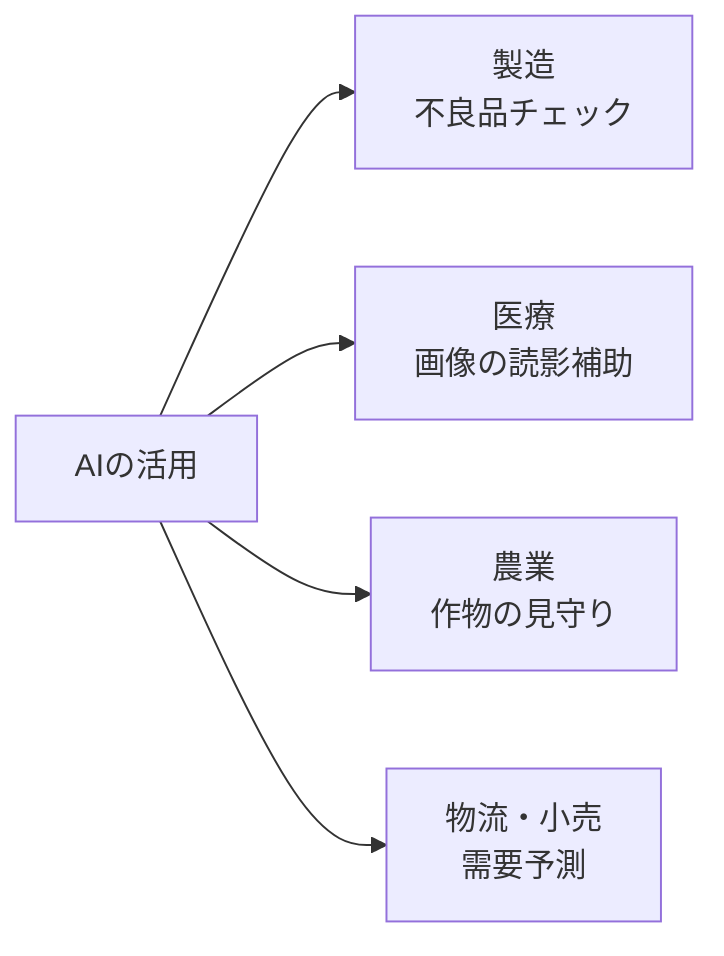

## このセクションで学ぶこと

- 製造・医療・農業・物流など、いろいろな産業でAIが使われていることを知る
- それぞれの現場でAIが「人の苦手」を補っていることに気づく
- AIは人を置きかえるより、人と組んで力を発揮する場面が多いと理解する

## AIはもう「実験室」を出ている

ここまで「AIはこう作る」という話をしてきました。では実際、世の中のどんな場所でAIは働いているのでしょうか。AIはすでに研究室の外に出て、さまざまな産業の現場で当たり前に使われています。代表的な例をのぞいてみましょう。

## 現場ごとの使われ方

**製造業** では、ベルトコンベアを流れる製品の写真をAIが見て、キズや欠けがないかをチェックします。第4章で見た画像認識の応用です。人間が一日中目を凝らすと見落としが出ますが、AIは疲れません。この「ふだんと違うものを見つける」働きを **異常検知** と呼びます。

**医療** では、レントゲンやCTの画像から、お医者さんが見落としやすい小さな影をAIが指摘します。AIが最終判断をするのではなく、お医者さんの「もう一つの目」として手伝う使い方が中心です。

**農業** では、ドローンで撮った畑の写真から、病気の作物や水の足りない場所をAIが見つけます。広い畑を人が歩いて回るのは大変ですが、AIなら一気に見渡せます。

**物流・小売** では、「来週この商品がどれくらい売れそうか」をAIが見積もり、仕入れの量を決める手助けをします。この「これからどれくらい必要か」を見積もる働きを **需要予測** と呼びます。

## 共通しているのは「人の苦手を補う」こと

こうして並べると、共通点が見えてきます。どの現場でも、AIは **人が苦手なこと** を引き受けています。一日中見続ける、広い範囲を一気に確認する、大量の数字から先を読む——人間が疲れたり見落としたりしやすい作業です。

そしてもうひとつ大事な点があります。これらの例の多くで、AIは人を置きかえているのではなく、**人と組んで** 働いています。医療の例のように、最後に判断するのは人で、AIはその手助けをする。「AIか人か」ではなく「AIと人で」という形が、現場では現実的でうまくいきやすいのです。

AIに任せて人がチェックする、という組み合わせには理由があります。AIは疲れず大量に処理できる一方で、ときどき思いがけない間違いをします。だから、AIが拾い上げた候補を人が最後に確認することで、両者の弱点を補い合えるのです。たとえば製造の不良品チェックでも、AIが「あやしい」と印を付けたものだけを人が見れば、全部を人が見るより圧倒的に楽になります。

## 自分の身近な仕事に当てはめてみる

ここで挙げた例はほんの一部です。大切なのは、これらに共通する考え方を、自分の身近な仕事に当てはめてみることです。「毎日くりかえしている単純作業はないか」「大量のデータから何かを見つける場面はないか」「先を予測できたら助かる場面はないか」——こうした問いを持つと、自分の現場でもAIが活きる場所が見えてきます。AIの活用例を知ることは、そのまま「自分の仕事のどこを楽にできるか」を考えるヒントになるのです。

## まとめ

- AIは製造・医療・農業・物流など、すでに幅広い産業で使われている。
- どの現場でも、AIは「一日中見続ける」「先を読む」など人が苦手なことを補っている。
- AIは人を置きかえるより、人と組んで力を発揮する場面が多い。
