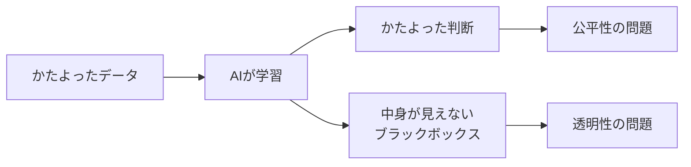

## このセクションで学ぶこと

- AIが学んだデータのかたよりが、そのまま判断のかたよりになることをイメージできる
- 公平性や透明性がなぜAIで問題になるのかを具体例で理解する
- AIの判断は「中立で正しい」とは限らないと気づく

## AIは「機械だから公平」ではない

「人間は感情で判断がぶれるけれど、AIは機械だから公平だろう」と思われがちです。ところが、実はそうとは限りません。AIは第2章で見たように「データから学ぶ」しくみです。つまり、学んだデータがかたよっていれば、その**かたよりごと学んでしまう**のです。この判断のかたよりを **バイアス** と呼びます。

たとえば、ある会社が「過去に採用した人」のデータを使って、応募者を選ぶAIを作ったとします。もし過去の採用で、たまたま特定の性別ばかりが選ばれていたら、AIは「この性別を選ぶのが正解だ」と学んでしまいます。すると、新しい応募者に対しても同じかたよった判断をくり返してしまうのです。AIに悪気はありません。ただ、与えられたデータを忠実に映しただけなのです。

ここがAIの怖いところでもあります。人間なら「これはさすがに不公平かな」とためらう場面でも、AIは過去のパターンを淡々と再現します。しかも大量の判断を一瞬でこなすため、かたよりがあった場合の影響は人間より広く、速く広がってしまいます。「機械だから公平」という思い込みが、かえって危ないのです。

## 公平性 — 誰かが不当に損をしていないか

こうして問題になるのが **公平性** です。性別や人種、住んでいる地域などによって、AIが不当な差をつけていないか、ということです。

実際に海外では、AIによる採用システムやローン審査で、特定の属性の人が不利に扱われていた、という事例が報告されています。本人は「AIが決めたこと」と言われると、なぜ落とされたのか分からず、反論もしにくくなります。便利な道具のはずが、知らないうちに誰かを傷つけてしまうおそれがあるのです。

## 透明性 — なぜその答えになったのか

もう一つ大きな問題が **透明性** です。とくに第3章で見たディープラーニングは、中で膨大な計算をしているため、「なぜこの答えを出したのか」が人間に説明しにくいのです。中身が見えないこの状態を **ブラックボックス** と呼びます。

病院の診断や裁判のように、人生を左右する場面でAIを使うとき、「理由は分かりませんが、AIがそう言うので」では困ります。判断が間違っていたとき、どこを直せばよいのかも分かりません。そこで近年は、AIの判断の理由をなるべく人間に分かるように示す工夫(説明可能なAI)も研究されています。

大事なのは、AIの答えを「正解」として鵜呑みにしないことです。AIは平気で、もっともらしい顔をしてかたよった判断や間違いを出します。便利だからこそ、最後に「本当にこれでいいのか」を確かめるのは人間の役目だと覚えておきましょう。

## まとめ

- AIはデータのかたよりごと学ぶため、判断にバイアスが出ることがある。
- 性別や人種で不当な差が出ていないか、という公平性が問われる。
- ディープラーニングは中身が見えにくく、判断理由を説明する透明性も課題になる。
