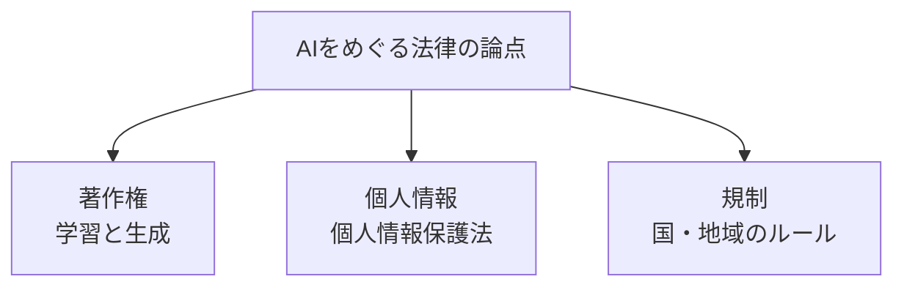

## このセクションで学ぶこと

- 生成AIをめぐって著作権がなぜ論点になるのかをイメージできる
- AIが扱う個人情報と、日本の個人情報保護法の関わりを知る
- 世界でAIを規制しようとする動きが始まっていることを理解する

## 生成AIと著作権 — 誰の作品なのか

第4章で見た生成AIは、大量の文章や絵を学んで、新しい文章や絵を作り出します。ここで悩ましい問題が生まれます。**著作権** の問題です。

論点はおおきく2つあります。1つは「学ぶときの問題」です。AIは世の中にある作品を大量に読み込んで学習しますが、その中には他人が作った文章や絵が含まれます。これを勝手に学習に使ってよいのか、という議論があります。もう1つは「作るときの問題」です。AIが生み出したものが、たまたま既存の作品にそっくりだった場合、それは権利を侵害したことになるのか、という点です。

日本の著作権法では、AIの学習について一定の範囲で柔軟に認める考え方がある一方、AIが作ったものが既存作品に似すぎている場合は問題になりうる、と整理されています。ただしこれは状況によって判断が変わる発展途上の分野で、ここでの説明も確定した法的助言ではなく、一般的な論点の紹介として受け取ってください。

身近な例で考えてみましょう。あるイラストレーターの絵柄をたくさん学ばせて、そっくりな絵をどんどん作れるAIがあったとします。作られた絵は便利かもしれませんが、元のイラストレーターからすると「自分の作風を勝手にまねされた」と感じるでしょう。技術的にはできても、誰かの権利や気持ちを傷つけていないか、という視点が欠かせないのです。

## 個人情報 — 勝手に集めて学ばせてよいか

もう一つ身近なのが **個人情報** です。AIに学ばせるデータの中に、名前・住所・顔写真・購入履歴といった個人を特定できる情報が含まれることがあります。

日本には **個人情報保護法** という法律があり、こうした情報を集めたり使ったりするときには、目的を伝えたり本人の同意を得たりといったルールを守る必要があります。「便利だから」と何でもAIに食べさせてよいわけではない、ということです。第5章で「データの集め方には落とし穴がある」と触れましたが、その落とし穴の一つがこの個人情報の扱いなのです。

これは作る側だけの話ではありません。私たちが生成AIを使うときも同じです。たとえば社内の顧客名簿や、人の個人情報をそのままAIに入力すると、それが外に漏れたり、思わぬ形で使われたりするおそれがあります。便利な道具に頼るほど、「これは入力してよい情報なのか」と一度立ち止まる習慣が大切になります。

## 世界で進むAIのルールづくり

技術の進みがあまりに速いため、法律やルールが追いつこうと急いでいます。これが **AI規制** の動きです。たとえば欧州(EU)では、AIを危険度に応じて区分し、リスクの高い使い方には厳しい条件を課す、という包括的なルールづくりが進んでいます。日本でも事業者向けの指針が示されるなど、安全に使うための枠組みが少しずつ整えられています。

## まとめ

- 生成AIでは「学ぶとき」と「作るとき」の両面で著作権が論点になる。
- 個人情報を扱うときは個人情報保護法などのルールを守る必要がある。
- 世界ではAIを安全・公正に使うための規制づくりが進み始めている。
