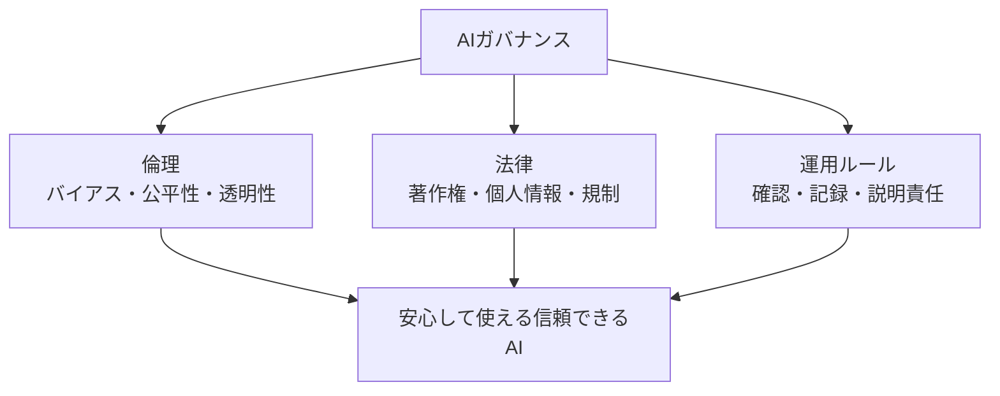

## このセクションで学ぶこと

- AIガバナンスが「AIを安全に使い続けるための仕組みづくり」だとイメージできる
- 倫理・法律・運用ルールがひとつにつながって機能することを理解する
- 一人ひとりがAIと賢くつき合う姿勢も大切だと気づく

## バラバラの心配ごとを、まとめて面倒みる

ここまで、AIにはバイアスや公平性といった倫理の問題があり、著作権や個人情報といった法律の問題もある、と見てきました。では、これらをどう手当てすればよいのでしょうか。心配ごとを一つひとつ場当たり的に対処していては、いつかどこかで抜け落ちてしまいます。

そこで登場するのが **AIガバナンス** という考え方です。むずかしそうな言葉ですが、中身は「AIを安全・公正に使い続けるための、組織や社会のルールと見張りの仕組み」のことです。たとえるなら、車を安全に走らせるために、信号・車検・運転免許・交通ルールがまとめて用意されているのと同じです。車そのものを速くする話ではなく、みんなが安心して使える「環境」を整える話なのです。

ここで大事なのは、AIガバナンスは「AIを禁止する」ためのものではない、という点です。むしろ逆で、安心して使える土台を整えることで、AIをもっと積極的に活かせるようにするのが狙いです。ブレーキがしっかりしている車ほど、安心してアクセルを踏めるのと同じ理屈です。

## 倫理・法律・運用をひとつにつなぐ

AIガバナンスは、前の2つのセクションで見た倫理と法律を、実際の運用ルールとひとつにつなげます。具体的には、AIを使う前に「かたよりがないか確認する」、判断の記録を残しておく、何か問題が起きたときに誰が責任を持つかをあらかじめ決めておく、といった工夫です。この最後の「誰が責任を持つか」を **説明責任** と呼びます。

国や業界団体は、こうした取り組みのお手本として **ガイドライン**(指針)を示しています。法律のように罰則はなくても、「こう使えば安心ですよ」という道しるべになります。

## 使う側の私たちにもできること

AIガバナンスは、作る側や国だけの話ではありません。使う私たち一人ひとりの心がけも、その一部です。AIの答えを鵜呑みにせず「本当かな?」と一度立ち止まる、個人情報を不用意に入力しない、おかしな結果に気づいたら声をあげる。こうした小さな姿勢が、AIを社会全体で賢く使いこなす力になります。

この章で見てきた倫理・法律・ガバナンスは、どれも「AIは便利だが万能ではない」という同じ前提から出発しています。だからこそ、技術の中身を完璧に理解していなくても、「AIにも限界やリスクがある」と知っているだけで、ずいぶん上手につき合えるようになります。AIは魔法でも万能でもなく、私たちが賢く手綱を握って使っていく道具なのです。

## まとめ

- AIガバナンスは、AIを安全・公正に使い続けるためのルールと仕組みづくり。
- 倫理・法律・運用ルールをひとつにつなぎ、信頼できるAIを目指す。
- 使う私たち一人ひとりが賢くつき合う姿勢も、ガバナンスの大切な一部。
